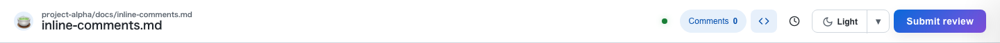
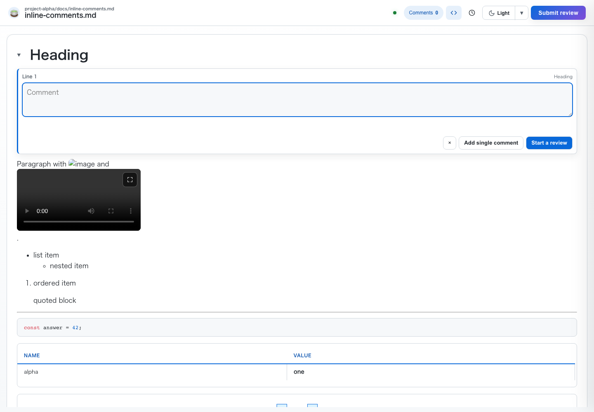
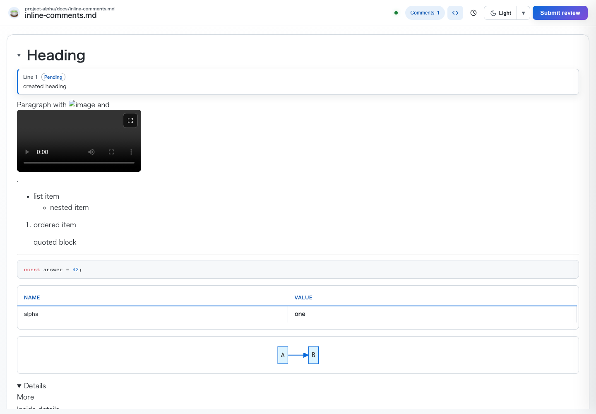
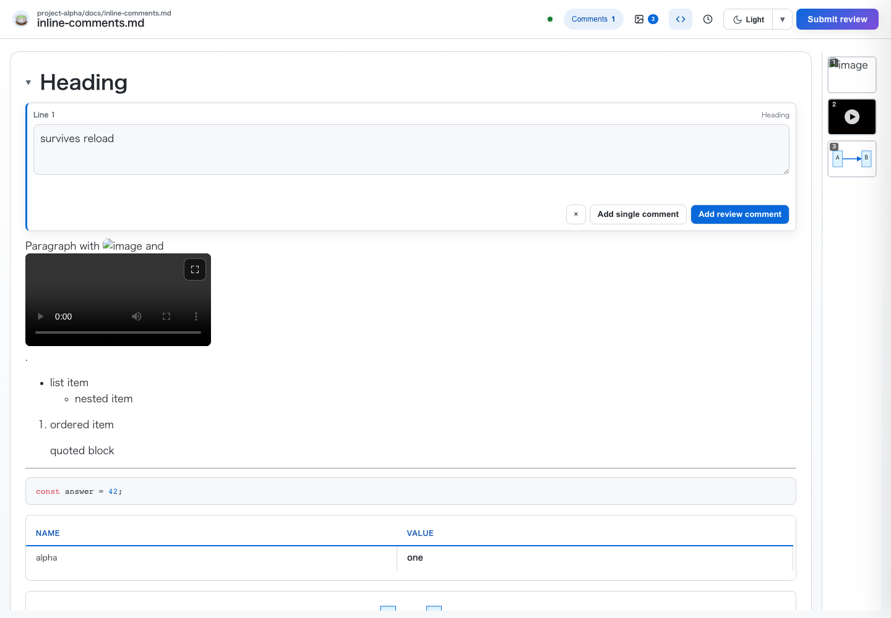
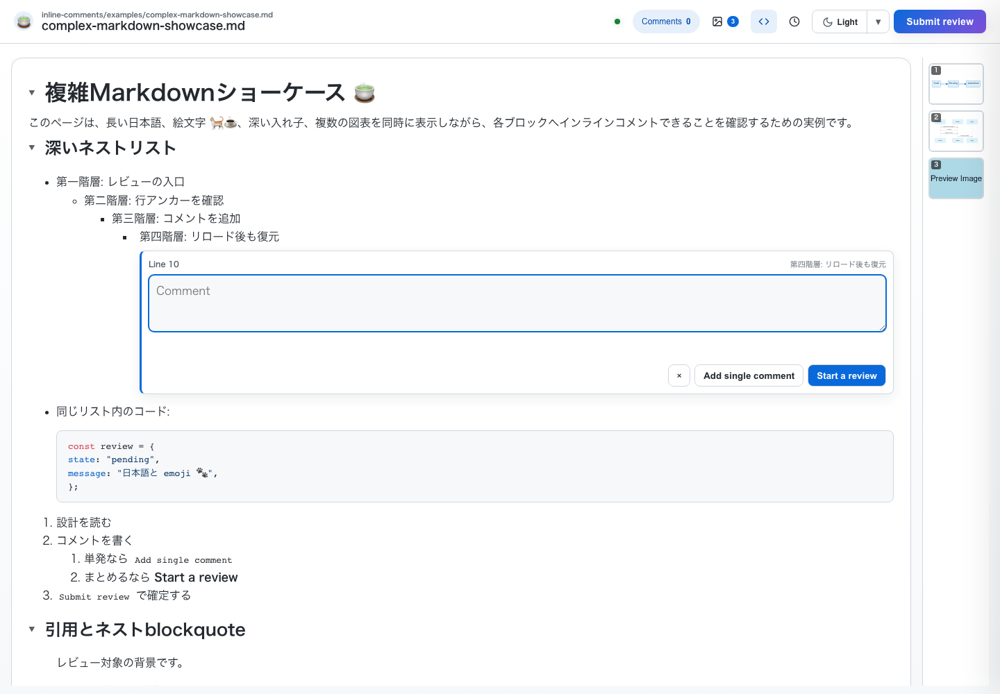
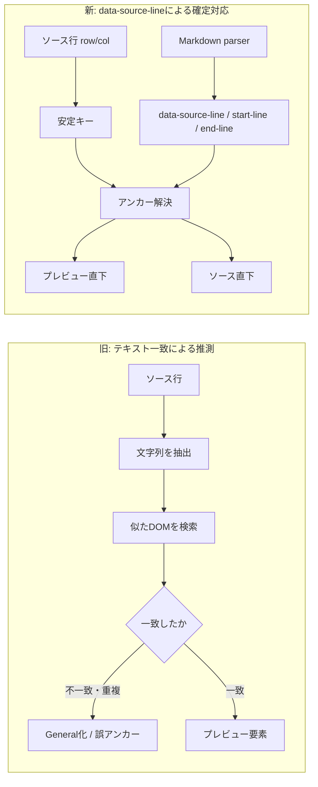
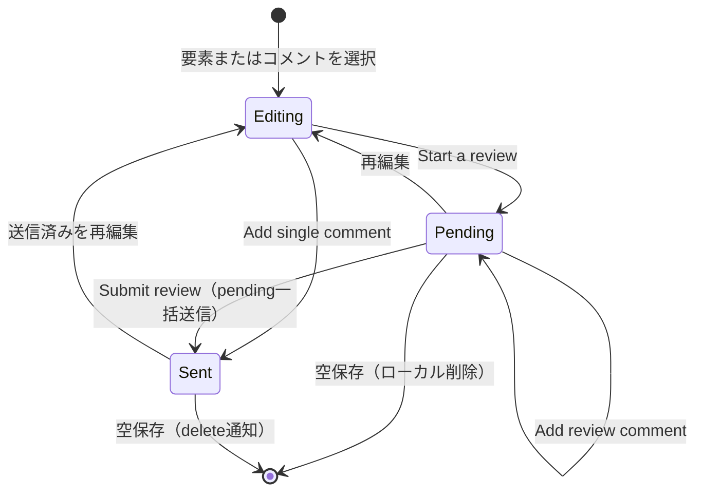

# Inline Comments 全面リニューアル レビュー報告

更新日: 2026-07-17  
ブランチ: `feature/inline-comments`  
状態: 実装・全自動テスト・目視確認完了／ユーザーレビュー待ち

## 依頼内容

Markdownの全ブロック要素へ、対象直下で作成・常時表示・再編集・削除できるインラインコメントを導入する。あわせて、左上ヘッダーからプロジェクト名が消えたデグレ、GitHub PRレビューと異なりSaveで即送信されるコメントライフサイクル、右下Commentsパネルが右側メディアサイドバーへ重なる問題を修正する。RCレビューで報告された「インラインコメントに文字を打てない」「Headingの下の表示も壊れている」を解消し、editor挿入前後に表示を壊さないrect検証を追加する。RC2ではdetails/summaryの内容とopen状態を正しく描画し、複雑Markdownショーケースを追加するとともに、diff・CSV・TSV・plain text・HTML previewを横断監査してTSVセルコメントが動作しない既存バグも修正する。RC4では、4989からの固定ポート探索を50件へ拡大して全滅時にOS割当ポートへ移行し、タブcloseや画面遷移による自動Submit・通知・サーバー終了を廃止する。

## 📌 Attention Required（今回確認してほしい点）

| 優先度 | 確認項目 | 完了条件 |
|---|---|---|
| 高 | 全Markdown要素のインラインコメント | 対象直下・本文幅で保存→編集→空保存削除が成立する |
| 高 | GitHub式レビュー | `Add single comment`だけ即時送信し、review commentはSubmitまで`Pending`になる |
| 高 | Commentsパネル | sidebarの展開・折り畳み・縦スクロールバー有無にかかわらず重ならない |
| 中 | ヘッダー | `プロジェクト/相対パス`とファイル名を判別できる |

## 🔄 User Request ⇄ Response（修正依頼と対処）

| # | User Request（原文） | 対処 | 検証 |
|---:|---|---|---|
| 1 | 「左上ヘッダーがファイル名のみでプロジェクトが判別できないデグレを修正すること」 | 重複CSSを整合させ、title-pathを表示 | ヘッダーassert＋画像00 |
| 2 | 「GitHub PRレビューと同一概念・同一英語文言に統一する」 | Add single comment / Start a review / Add review comment / Submit reviewとpending/sent状態を実装 | `send_now.ts` 11 PASS |
| 3 | 「右下のCommentsリストパネルが右側のメディアサムネ一覧バーに被って表示される」 | sidebar左端基準の動的offsetへ変更 | 展開・折り畳みassert＋画像04 |
| 4 | 「見出し行の真下・full widthで表示されるようにして」 | heading editor/viewをtoggle-content先頭へ移設 | 座標・幅assert＋画像01/02 |
| 5 | 「インラインコメントに文字を打てない」 | fullscreen開始時にeditorをローカルPending保存して閉じ、フォーカスをoverlayへ明け渡す | overlay中にeditor/input 0、隠れtextarea focusなし、draft保持を実Chrome/E2Eで確認 |
| 6 | 「localStorage復元後、同一コメントが editor と Pendingビュー の二重表示になる」 | editor挿入時に同じkey・同じsurfaceのviewだけを除去 | restore後にeditor 1・同一surface view 0・反対surface view 1をassert |
| 7 | 「Headingの下の表示も壊れている」 | 段落内`.video-overlay-wrapper`を`block`かつ`fit-content`に変更 | editor前後の全block rect非重複assert＋画像01 |
| 8 | 「fullscreen overlay表示中もコメント用キーボードショートカットが生きている」 | fullscreenを共通入力占有状態にし、keyboardとeditor生成最終入口を遮断 | fullscreen中の`i`/`Enter`後もeditor 0・localStorage不変をassert |
| 9 | 「details/summaryのsummary内容が『詳細』に置換され open が無視される」 | authored summaryのstrong等のインライン内容を保持し、`open`属性を尊重して描画 | `complex_markdown_showcase.ts`でrich summary、open、nested、closedの各状態をassert |
| 10 | 「もっと複雑なマークダウンもみたい」 | `examples/complex-markdown-showcase.md`を追加し、深いネスト、リスト内コード、引用、Mermaid、表、details、生HTML、日本語・絵文字、脚注・参照リンクを収録 | `complex_markdown_showcase.ts` 19/19 PASS。全対象の行アンカーと代表要素のコメント操作を検証 |
| 11 | 「他のファイルチェックとかもレイアウトおかしいやつがあった」 | diff・CSV・TSV・plain text・HTML previewの5モード監査E2Eを新設し、`app.mbt`のmode dispatchに`tsv`がなくTSVセルコメントが全て無効だった既存バグを修正 | `inline_comment_modes_layout.ts` 14/14 PASS。各モードのeditor可視性、重複、overflow、対象との非重複をassert |
| 12 | 「summary除外による見出しクリック回帰」 | authored summaryだけをネイティブ開閉経路へ分離し、`heading-summary`配下のh1〜h6は従来の見出しコメント経路へ委譲 | `inline_comments.ts` 59/59、`complex_markdown_showcase.ts` 19/19、`preview_interaction_regression.ts` 12/12 PASS |
| 13 | 「ダークテーマでMermaidの線が見えない」 | Mermaidをアプリテーマへ連動させ、darkのsequence線・ラベルを明色化。テーマ復元・切替時に再描画 | dark背景に対する矢印線3:1以上・ラベル4.5:1以上のコントラストをassert |
| 14 | 「ビデオありの例が見れない」 | showcaseへ既存の`./videos/video-landscape.mp4`を追加 | 動画描画、行アンカー、タイムラインサムネ2件以上、動画コメントをassert |
| 15 | 「これサムネに対してのコメントになってる？秒数とか必要なのでは？」 | 動画・タイムラインコメントのeditor/viewを`Video m:ss · Line n`表示へ変更 | editorと保存後viewの両方で時刻が行番号より先に表示されることをassert |
| 16 | 「vim_keys.tsのin-chain flakeをテスト堅牢化」 | resolve後のDOM安定4条件を待ち、Submit shortcutを最大3回のbounded retryへ変更 | `github_pr_sync.ts → vim_keys.ts`連続2回で各16/16 PASS |
| 17 | 「E2Eの未指定ポートを一意の高番BASE_PORTへ」 | 実HTTPサーバー4本へ5680〜5684を割り当て、`--port 0`と4989探索依存を除去 | 全E2E監査＋`npm test`フル all passed / exit 0 |
| 18 | 「探索範囲を大幅拡大し、それでも全滅時はport 0にフォールバックして必ず起動する」 | 固定候補を50ポートへ拡大し、全EADDRINUSE時はNodeへport 0を渡す。bind後の実ポートでURL・lock・review server・share metadataを確定 | 50ポートを実socketで占有してOS割当、実ポートlock、`0.lock`不在、health 200を10契約E2Eで確認 |
| 19 | 「明示的なSubmitダイアログでの操作以外ではyunomiは落ちない・通知も飛ばない」 | closeタイマー・reload時刻相関・`handle_submit`自動呼び出しを削除。closeはtab登録解除だけとし、入力時localStorage draftを維持 | 最終tab close後5.5秒でもhealth 200・verdictなし、再訪復元、明示Submitでのみexitを20契約E2Eとfull suiteで確認 |

## 📋 Previous Feedback Response（累積フィードバック履歴）

<strong>Latest: RC4レビュー — ポート枯渇とclose自動Submit</strong>

- 「4989から10個walkで全滅すると起動不能」→ 50ポート探索後にOS割当のエフェメラルポートへ移行し、実bindポートをlock・URL・metadataへ反映。
- 「タブを閉じただけでsubmitが飛ぶ」→ close起点のタイマー・Submit・通知・exitを全削除し、明示Submit Reviewだけを終了経路に限定。
- close時の無条件draft再保存が空の復元モーダルを作る回帰も検出し、既存の入力時localStorage保存へ一本化。

<strong>Previous: RC3レビュー — dark Mermaid、動画例、時刻アンカー</strong>

- 「ダークテーマでMermaidの線が見えない」→ themeVariablesを補強し、テーマ切替時の再描画と実コントラスト検証を追加。
- 「ビデオありの例が見れない」→ showcaseへ横長動画とタイムラインを追加。
- 「これサムネに対してのコメントになってる？秒数とか必要なのでは？」→ editor/viewの主ラベルを`Video m:ss`へ変更。
- フルスイートで顕在化したvimキー同期とデフォルトポート競合をテスト側で恒久対策。

<strong>Latest: RC2レビュー — details、複雑Markdown、全表示モード監査</strong>

- 「details/summaryのsummary内容が『詳細』に置換され open が無視される」→ authored summaryの内容とopen状態を保持。
- 「もっと複雑なマークダウンもみたい」→ 見栄えを整えた複雑Markdownショーケースと19契約E2Eを追加。
- 「他のファイルチェックとかもレイアウトおかしいやつがあった」→ 5モードを横断監査し、TSVセルコメント全死を修正。
- summary除外が見出しクリックまで遮った回帰を修正し、関連3 E2Eを全緑化。

<strong>Previous: RCレビュー — 入力フォーカス、復元、表示非破壊</strong>

- 「インラインコメントに文字を打てない」→ fullscreen裏のeditorとfullscreen中ショートカットを両方遮断。
- 「localStorage復元後…editorとPendingビューの二重表示」→ 編集surfaceのviewだけを除去。
- 「Headingの下の表示も壊れている」→ 段落内videoを独立blockへ変更し、全block rect非重複を検証。

<strong>Previous: 見出し配置と再編集</strong>

- 「見出し（h1〜h6）だけ配置が崩れる」→ summary内ではなくtoggle-content先頭へ移設。
- 「保存済みviewクリック→編集モード切替の経路が壊れた可能性」→ summary内の元見出しを再解決。

<strong>Commentsパネルとスクロールバー</strong>

- 「右下のCommentsリストパネルが右側のメディアサムネ一覧バーに被って表示される」→ sidebar実位置へ追従。
- 「縦スクロールバー16pxがあるページでは…2px越えて重なり」→ viewport右端からsidebar左端までをoffset化。

<strong>GitHub式ライフサイクル</strong>

- 「Saveを押してもコメントがエージェントに即送信されている」→ review保存から即時送信を除去。
- 「'Add single comment'…'Start a review'…'Add review comment'…'Submit review'」→ 指定英語文言と状態遷移を実装。

<strong>要素別・既存E2E回帰</strong>

- list-item、image、video、mermaid、diff、SSE、keyboard、reload refreshの各FAILを、同じrow/key/可視anchor契約へ統一して解消。
- `inline_comments.ts` 59 PASS、`npm test` all passedで最終確認。

## Evidence

| ヘッダーパス | 見出し直下のeditor |
|---|---|
|  |  |

| source/preview両面 | リロード復元 |
|---|---|
|  |  |

| Commentsパネルとメディアサイドバー |
|---|
|  |

| 複雑Markdownショーケース |
|---|
|  |

## WHY — なぜ壊れていたか

### コメント対象の対応がDOMテキスト探索に依存していた

旧実装はソース行とプレビュー要素をテキスト一致や周辺DOMから推測していた。リスト項目、動画ラッパー、Mermaid、表セル、生HTMLのようにDOMが変形・入れ子化される要素では、保存キーと再描画先が一致せず、Generalコメント化、描画欠落、別ペインへの二重editor生成が起きていた。

### コメントUIが対象要素から分離していた

旧`#comment-card`はフローティング表示で、対象との関係が位置頼みだった。画像・動画・Mermaidではfullscreenクリック処理とも競合し、保存や再編集を遮った。

### Saveと送信済み状態が分離されていなかった

`save_comment`が`send_comment_to_server`を直接呼び、レビュー用の下書き保存でも即送信していた。localStorageにもpending/sentの区別がなく、リロード後に未確定コメントを識別できなかった。

### レイアウトが固定値と非表示CSSに依存していた

`.title-path`はHTMLへ出力済みでも重複CSSで隠れていた。Commentsパネルは`right: 14px`固定でsidebarや縦スクロールバーを考慮せず、見出しコメントはflexな`summary`内へ挿入されて右横340px程度に縮んでいた。

### 起動と終了が固定数・暗黙イベントに依存していた

ポート探索は4989から10候補で打ち切っていたため、常駐レビューが並ぶと空きポートが残っていても起動不能になった。終了側は最後のtab closeから5秒後にdraftを`handle_submit`へ渡し、Submitダイアログを操作していないのにverdict・通知・process exitを発生させていた。

## HOW — どういう設計で直したか

### 旧テキスト探索から行アンカーへ

Markdown生成時にh1〜h6、p、li、ol、ul、td、th、pre、blockquote、hr、img、video、Mermaid、details、生HTMLへ`data-source-line`系属性を付けた。コメントキーと行属性から、source/preview両面へ同じスレッドを描画する。

### GitHub PRレビューと同じ状態遷移

`AppComment`の`pending`と`sent`を分離した。review commentはlocalStorageだけへ保存して`Pending`を表示し、`Add single comment`だけを即時送信、`Submit review`はpendingだけを一括送信する。

### DOM所有境界ごとに挿入先を固定

- 通常ブロック: 対象要素の直後
- 表: 対象`tr`直後の専用行
- 見出し: `details.heading-toggle`の`.toggle-content`先頭
- 画像・動画・Mermaid: ✎ボタンから起動し、通常クリックのfullscreenを維持
- source/preview: editorは操作側だけ、反対側はview

### Commentsパネルはsidebar左端から逆算

`--media-sidebar-offset`へ`window.innerWidth - sidebar.getBoundingClientRect().left`を設定し、Commentsを`right: calc(var(--media-sidebar-offset) + 14px)`へ配置した。ResizeObserver、class変更、resize、折り畳みに追従し、16pxの縦スクロールバーがある長文で起きた2pxの重なりも解消した。

### port 0はbind後の実ポートへ置き換える

固定候補を50件まで試し、全候補が使用中ならNodeの`listen(0)`へ委ねる。listen callbackで`server.address().port`を取得し、その実ポートだけを起動URL、lockファイル名・内容、review server情報、share token metadataへ保存する。失敗した候補はSSE heartbeatを生成せず、bindに成功したserverだけがタイマーを持つ。

### closeとSubmitを別の状態遷移にする

`/close`はtab/instance整合を確認してactive tabから外すだけにした。コメント・summary・質問回答は入力時にlocalStorageへ保存済みであり、再訪時に復元できる。verdict生成、通知、lock削除、process exitはSubmit Reviewダイアログからの明示的な`POST /exit`だけが実行する。

## WHAT — 何をどのファイルで変えたか

| ファイル | 主な変更 |
|---|---|
| `v2/src/core/markdown.mbt` / `markdown_test.mbt` | 全対象ブロックへ行属性を付与し網羅テストを追加 |
| `v2/src/ui/dom.mbt` | inline editor/view、保存view再編集、見出し・表・mediaのDOM解決 |
| `v2/src/ui/app.mbt` | pending/sent、localStorage復元、SSE受信、pending一括Submit |
| `v2/src/ui/media_sidebar.mbt` | sidebar左端基準のComments offset計測と追従 |
| `v2/src/server/main.mbt` / `ffi.mbt` | 50ポート探索、OS割当後の実ポート確定、close自動Submit経路の廃止 |
| `v2/src/core/css.mbt` | inline thread、Pending、title-path、sidebar回避スタイル |
| `v2/src/core/html.mbt` | GitHub式英語文言、プロジェクト/相対パス表示 |
| `v2/e2e/inline_comments.ts` | 15要素、復元、fullscreen入力占有、表示非破壊、sidebar非重複の59契約 |
| `v2/e2e/send_now.ts` | 即時送信、review pending、sent永続化の11契約 |
| `examples/complex-markdown-showcase.md` | 深いネスト、複数Mermaid、details、生HTML、横長動画とタイムラインを収録した複雑Markdownショーケース |
| `v2/e2e/complex_markdown_showcase.ts` | summary/open、行アンカー、dark Mermaid、動画・時刻ラベルを含む25契約 |
| `v2/e2e/inline_comment_modes_layout.ts` | diff・CSV・TSV・plain text・HTML previewのレイアウト監査14契約 |
| `v2/e2e/port_auto_fallback.ts` / `close_race_regression.ts` | 50ポート枯渇時の実bind/lock整合と、close非終了・復元・明示Submit限定を実環境で検証 |
| 既存E2E群 | フローティングカード前提をinline契約へ更新し実回帰を追加 |

## ビフォー・アフター比較

| 項目 | Before | After |
|---|---|---|
| 対象解決 | テキストとDOM位置から推測 | `row/col`と`data-source-line`で確定 |
| 編集UI | フローティング`#comment-card` | 対象直下のfull-width editor |
| 保存表示 | サイドリストと`.has-comment` | source/preview両方の対象直下 |
| Save | 即時送信 | review commentはローカルpending |
| 即時送信 | `Send now` | `Add single comment` |
| レビュー | Saveと送信の区別なし | Start→Add review comment→Submit review |
| 未送信表示 | なし | localStorage永続化＋`Pending` |
| ヘッダー | ファイル名のみ | プロジェクト/相対パス＋ファイル名 |
| Comments | sidebarへ重なる | sidebar左端から14px離して追従 |
| ポート枯渇 | 10候補で起動失敗 | 50候補後にOS割当し実ポートを記録 |
| タブclose | 5秒後にdraftを自動Submitして終了 | draftはlocalStorageへ残し、serverは明示Submitまで待機 |

## テスト結果

| 検証 | 結果 | 内訳 |
|---|---:|---|
| `moon test --target js` | 188/188 PASS | 行アンカー、details、リスト内コードフェンスを含むMoonBit全テスト。廃止したclose時刻相関テスト7件を除去 |
| `moon build --target js --release` | PASS | JS release成果物 |
| `v2/e2e/inline_comments.ts` | 59/59 PASS | 15要素×保存・編集・削除=45、見出し配置/非重複=2、共通=12 |
| `v2/e2e/complex_markdown_showcase.ts` | 25/25 PASS | 複雑Markdown、details/summary、dark Mermaid、動画・タイムライン、時刻ラベル |
| `v2/e2e/inline_comment_modes_layout.ts` | 14/14 PASS | diff・CSV・TSV・plain text・HTML previewの表示非破壊監査 |
| `v2/e2e/preview_interaction_regression.ts` | 12/12 PASS | preview/source選択、再読込、Mermaid・media操作の回帰 |
| `v2/e2e/vim_keys.ts` | 16/16 PASS × 2 | `github_pr_sync.ts`直後の連続実行でも安定 |
| `v2/e2e/send_now.ts` | 11/11 PASS | 即時送信、pending local、pending/sent永続化 |
| `v2/e2e/port_auto_fallback.ts` | 10/10 PASS | 次ポートfallback、50ポート枯渇、OS割当、実port lock、health |
| `v2/e2e/close_race_regression.ts` | 20/20 PASS | reload、6秒遅延reconnect、close後待機、draft復元、明示Submit限定 |
| `npm test` | all passed / exit 0 | 新E2E、MoonBit 188件、旧E2Eを含むフルスイート |

新E2E対象はheading、paragraph、unordered-list、list-item、ordered-list、blockquote、horizontal-rule、code、table-header、table-cell、image、video、mermaid、details、raw-html。追加契約はeditor前後のblock非重複、fullscreen開始時のeditor close・focus解放・draft保持、fullscreen中`i`/`Enter`遮断、restore時の同一surface二重表示防止。既存のフローティングカード不在、ヘッダーパス、localStorage、sidebar展開・折り畳み、reload/Pending復元、runtime error不在も維持する。

## 反復で解消した回帰

| 回帰 | 根本原因 | 解消内容 |
|---|---|---|
| SSEオフバイワン・外部コメント未描画 | server/browserのrow・再描画契約差 | SSE受信を同じrow/key契約へ正規化し再描画 |
| diffコメントがGeneral扱い | `td[data-row]`の行アンカー消失 | diffセルのrow/colを保存・描画まで維持 |
| editorが2個・ID重複 | 同じkeyの両surfaceをediting化 | 操作側だけeditor、反対側はview |
| closed detailsへhidden editor | 非表示候補も探索対象 | `details:not([open])`配下を除外 |
| 画像だけ✎欠落 | fixture固有の画像host解決漏れ | リンク・段落・表内画像にも常設 |
| image/Mermaidをfullscreenが遮る | コメントクリックが親へ伝播 | コメントUIをfullscreen対象から除外 |
| video保存後に描画されない | wrapper移設後のkey不一致 | video属性とwrapperアンカーを統一 |
| refresh後にeditorがhidden | 再構築前DOMへ残留 | 現行の可視アンカーへ再配置 |
| Commentsがsidebarへ2px重なる | viewport 1440とlayout 1424の差 | viewport右端からsidebar左端を計測 |
| 見出しが右横340px | flexなsummary内へ挿入 | toggle-content先頭へfull width配置 |
| 見出しviewを再編集できない | 移設後holderにprevious siblingなし | summary内の元見出しを再解決 |
| fullscreen中に文字が見えず吸われる | overlay裏のeditor textareaがfocusを保持 | fullscreen開始前にPending保存してeditorを閉じ、focusを解放 |
| restore後にeditorとPending viewが二重表示 | view描画後に同じsurfaceへeditorを追加 | 同じkey・同じsurfaceのviewだけを除去 |
| 段落内videoがHeading下の行へ突き出す | wrapperがinline-block baselineへ参加 | block＋fit-contentで独立行にし、全block rect非重複を検証 |
| fullscreen中の`i`/`Enter`で裏にeditorが開く | shortcutとeditor生成入口がoverlay状態を未確認 | fullscreenをdialog占有状態へ追加し、`select_source_range`でも拒否 |
| detailsのsummary内容が「詳細」へ置換されopenが消える | 生HTML details処理がsummary本文と開始タグ属性を捨てた | rich inline summaryを保持し、sanitizedな`open`属性と行アンカーを出力 |
| リスト内コードフェンスがpreにならない | list rendererが深いインデント行を`br + render_inline`へ流した | リスト内fenceを`pre`として描画しstart/end lineを付与 |
| TSVセルをクリックしても選択・editor生成が0件 | mode dispatchが`csv`だけで`tsv`をtext処理へ落とした | `"csv" | "tsv"`で表クリック・resize/filter初期化を共有 |
| heading-summary内の見出しクリックでeditorが開かない | authored summary除外の`return`がheading-summary配下にも適用された | authored summaryだけreturnし、heading-summary内h1〜h6を見出し経路へ通過 |
| closed summaryのトグル結果を誤判定 | stale locatorとなった`details:not([open])`がクリック後に別要素へ再解決された | 固定テキストで同一authored summaryを特定して状態を検証 |
| summaryコメントE2Eが本体クリックでeditorを待つ | 新契約の本体クリック=開閉、✎=コメントをhelperが区別しなかった | open/closed authored summaryとも直下✎からeditorを起動 |
| dark Mermaidの矢印線・ラベルが背景へ溶ける | theme復元・切替がMermaid再描画へ未接続でsequence色も未指定 | dark用signal/text色を指定し、theme切替ごとに再描画 |
| darkコントラストE2Eが白背景を測る | 開始themeを確認せずtoggleし、lightへ戻して測定 | light→darkを明示し、実表示面`.mermaid-container`の背景を使用 |
| REPORT Latest検証がnull | RC見出し文言へ固定したselectorが累積更新でstale化 | `summary strong`の`Latest:`契約で検出 |
| 動画サムネのeditorが`Line 99`だけを表示 | 保存valueには時刻があるがeditorへ別contextを渡した | 同じvideo valueをeditor/viewで共有し`Video m:ss · Line n`表示 |
| vim_keysのMeta/Ctrl+Enterがチェーン時に消失 | resolve直後のreview-loop再描画中にキー入力 | resolved DOM・badge 0・All resolvedを待ち、bounded retry |
| questions E2Eが4989〜4998占有で起動不能 | 未指定または`--port 0`がデフォルト10ポート探索へ落ちた | 実HTTP E2Eへ5680〜5684の一意ポートを割当 |
| 実運用で4989〜4999が埋まるとyunomi自体が起動不能 | 固定ポート探索が10回でprocess exit | 50候補へ拡張し、全滅時はOS割当portへ移行。bind後の実portでlockとログを確定 |
| tab closeだけでverdict・通知・process exitが発生 | closeの5秒タイマーが`handle_submit`を直接実行 | close自動Submit・reload時刻相関を削除し、`POST /exit`を明示Submit専用に限定 |
| 通常reload後に空のRecovery modalが表示 | close時に無条件でdraftを再保存する初期RC4差分 | 既存の入力イベント保存へ一本化し、closeは空draftを新規作成しない |
| port再試行ごとにSSE heartbeatが残る | bind成功前に各candidateでintervalを開始 | heartbeat生成をlisten成功callback内へ移動 |
| share token URLをE2Eが読み落とす | 実port確定後の一般URLをtoken URLより先にログ出力 | 実port入りtoken URLを最初に出し、既存起動検出契約も維持 |

## 完了状態

- [x] インラインコメント全面リニューアル
- [x] ヘッダーパス表示デグレ修正
- [x] GitHub式pending/sentライフサイクル
- [x] Commentsパネル重なり修正
- [x] MoonBit・release build・新旧E2E全通過
- [x] 複雑Markdownショーケースと5モード表示監査
- [x] 50ポート枯渇時のOS割当と実port lock整合
- [x] close非Submit・非通知・非終了と再訪draft復元
- [x] 最新エビデンス6枚を目視確認
- [ ] ユーザー承認
