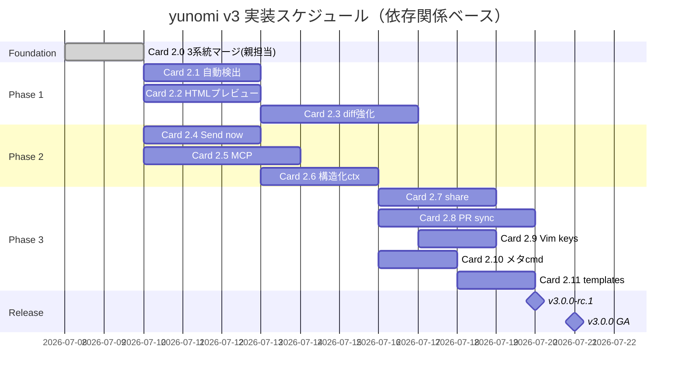

# yunomi v3 実装計画（Codex 単独遂行用 Task Card 集）

> **v3 とは何か**: yunomi 2.x は「1回のSubmitで完結する使い捨てビューア」。yunomi 3.0 は **「要件が決着するまで生き続けるレビューセッション」** — コメント即時通知、多ラウンドループ、ライブアプリピンコメント、双方向エージェント通信、を核とする**コンセプト刷新版**。バージョン `3.0.0-alpha.N` → `3.0.0` で publish する。
>
> **本ドキュメントの役割**: 北極星 PLAN [`/Users/kazuph/src/github.com/kazuph/yunomi/PLAN.md`](../../PLAN.md) を Codex が単独で消化できる粒度に噛み砕いた **Task Card 集** と **横断ルール**。Codex は "Task Card N.M を実装して" だけで着手できる。
>
> **作成**: 2026-07-08 by 親 p_145（Opus）／ **対象実装者**: Codex（gpt-5.3-codex-spark high 以上）／ Sonnet subagent はフォールバックのみ

---

## 0. 現在地スナップショット（2026-07-08 09:14 JST）

**yunomi CLI**: `2.3.0`（main HEAD `cf16b0e`）

**進捗状況**：

| Phase | 内容 | worktree | 実装 | 親p_145 の残作業 |
|---|---|---|---|---|
| **Phase 0** The Loop | 多ラウンドレビュー基盤 + Realtime Comment Relay | `feature/review-loop` | ✅ **完成**（commit `543e1a0`、実弾デモ成功） | E2E最終確認・mainマージ |
| **Phase 1-2** ライブアプリ | `yunomi live <url>` reverse proxy + DOM ピンコメント | `feature/live-review` | ✅ **完成**（Round 3緑茶再スタイル・実機スクショ4枚） | Chromium E2E代行・commit・mainマージ |
| **Phase 2-2/2-3** Agent Interop | `yunomi comment` / `yunomi install` | `feature/agent-interop` | ✅ **完成**（lockファイル同一ファイル探索修正済み） | Browser E2E代行・commit・mainマージ |
| Phase 1-1 | 変更ファイル自動検出 | (未着手) | ⏳ **未** | 実装委任 |
| Phase 1-3 | 静的HTML iframe レビュー | (未着手) | ⏳ **未** | 実装委任 |
| Phase 1-4 | コードdiff強化（Split/Unified・ファイルツリー・viewed済み） | (未着手) | ⏳ **未** | 実装委任 |
| Phase 2-1 | Send now（コメント単位即送信、インライン返信） | (部分) | 🟡 Phase 0 の relay で下地は完成、UI導線が未 | 実装委任 |
| Phase 2-4 | `yunomi mcp` MCPサーバーモード | (未着手) | ⏳ **未** | 実装委任 |
| Phase 2-5 | 構造化コンテキスト強化（周辺行スニペット・DOMセレクタ・添付画像） | (部分) | 🟡 review-loop が snippet を持つ、Phase 1-2 が selector/bounds を持つ、live/reviewの記法統一が未 | 実装委任 |
| Phase 3-1 | `yunomi share` 共有URL | (未着手) | ⏳ **未** | 実装委任 |
| Phase 3-2 | GitHub PR 同期 | (未着手) | ⏳ **未** | 実装委任 |
| Phase 3-3 | Vim キーバインド・キーボード完結 | (未着手) | ⏳ **未** | 実装委任 |
| Phase 3-4 | status / stats / cleanup メタコマンド | (未着手) | ⏳ **未** | 実装委任 |
| Phase 3-5 | レビューテンプレート | (未着手) | ⏳ **未** | 実装委任 |

**その他 worktree**：
- `feature/green-rebrand` — merged (`de5af72`)
- `feature/review-surfaces` — 空（REPORT.md 無し、`4a974dd` 単発コミット。Phase 1-1 に転用可能）

---

## 1. Codex 実装ルール（毎 Task Card 共通・熟読必須）

### 1.1 worktree 戦略
- **1 Task Card = 1 worktree**。既存 worktree の使い回し禁止（設計方針が汚染される）
- 作成: `cd /Users/kazuph/src/github.com/kazuph/yunomi && git wt feature/<task-slug>` （`git wt` は `git worktree add -b feature/<name> .worktree/feature/<name>`）
- ベース: 原則 `main` から切る。ただし Phase 2-1 は `feature/review-loop` から切る（relay に依存）
- `.git` 実体が sandbox 外 → **Codex は commit しない**。ready 報告後、親 `p_145` が commit する
- 完了後 worktree は親が判断（マージ後削除 or 保存）

### 1.2 MoonBit 罠（毎回忘れる）
- **JS target は ESM 出力**。インライン JS (`#|`) で `require()` は不可。`#module("node:xxx")` ディレクティブを使う
- MoonBit タプル `(Int, Int)` は JS では `{_0, _1}` オブジェクト。インライン JS で `[a, b]` を返すと `._0` が `undefined`
- インライン JS から `#module` インポートは参照不可（マングルされる）→ MoonBit 関数合成で回避
- `v2/src/core/css.mbt` は **同一セレクタが2箇所定義される罠**あり。色/幅/背景を触るとき必ず両方 grep で洗い出す
- `moon` は `v2/` 配下でしか動かない。Bash の cwd は絶対パス推奨

### 1.3 テスト・ビルド
- `cd v2 && moon test --target js && moon build --target js --release`
- e2e: `node --experimental-strip-types e2e/<test>.ts`
- 全部通す: `npm test`（v2 配下から呼ぶ、`test:v2` は `HERDR_PANE_ID=` `YUNOMI_NOTIFY_CMD=` で通知遮断する契約）
- 新規 e2e は `package.json` の `test:v2` に **必ず追加**

### 1.4 完了報告プロトコル
- 完了時: `herdr agent send p_145 '[<pane-label>] 完了: 要件=... 実装=... 検証=<moon test 結果、e2e 結果> ready-for-parent-commit'`
- 失敗時: `herdr agent send p_145 '[<pane-label>] 失敗: 段階=... 理由=... 次アクション=...'`
- `.artifacts/<feature-slug>/REPORT.md` を必ず書く（構造は 1.5 参照）
- **Chromium 起動が sandbox で失敗する場合は諦めて親に代行依頼**（他 pane で同じ環境制約なので試行を続けない）

### 1.5 REPORT.md 必須構造
北極星 PLAN の "Wave 0" レポートで確立された構造：

```markdown
# <Feature Title>

**一言でいうと**: <1文で何ができるようになるか>

## Review Focus
<何を確認してほしいか、証跡でどこを見るか>

## User Request ⇄ Response
| Round | User Request (原文) | Response | 検証方法 |

## WHY
## HOW
## WHAT
| Area | Change |

## Evidence
（実機スクショテーブル・E2Eログ・moon test ログ）
```

### 1.6 実装禁止事項
- **commit / push / バージョン変更 禁止**（親が担当）
- **npx yunomi 公開版を実装検証に使うな**（バグ入り可能性）→ 必ず自分の worktree の `v2/_build/js/release/build/server/server.js` を使う
- **他 worktree の書き換え禁止**（read-only 参照のみ可）
- **プロセス掃除は自 PID のみ**（詳細 §5.1）

---

## 2. Task Card 群

### Task Card 2.0 — 既完成 3 系統の main マージ整流化【親p_145 実施】

**担当**: 親 p_145（Codex ではない）
**やること**:
1. `feature/review-loop`（543e1a0）— `main` に merge / rebase
2. `feature/live-review`（Chromium E2E 代行 → commit → merge）
3. `feature/agent-interop`（Browser E2E 代行 → commit → merge）
4. 各マージ後に `npm test` で全 e2e 緑を確認
5. `package.json` の `version` を **`3.0.0-alpha.1`** に上げて `git tag` （publish はまだ）
6. マージ順は **review-loop → agent-interop → live-review**（依存: agent-interop の `yunomi comment` が relay の下地に乗る）

**受け入れ条件**:
- main で `moon test` 全緑、`npm test` 全緑
- 3 系統の e2e（review_loop.ts / live_review.ts / agent_interop_comment.ts）が独立して通る
- CHANGELOG.md に v3.0.0-alpha.1 の変更点を明記

---

### Task Card 2.1 — Phase 1-1 変更ファイル自動検出

**worktree**: `feature/auto-changes`
**依存**: Task Card 2.0 完了後の main

**やること**:
1. `yunomi review [<base-ref>]` サブコマンドを追加（引数なしは `git rev-parse --abbrev-ref HEAD@{upstream}` or `main`）
2. `git diff --name-only <base>...HEAD` で変更ファイル列挙 → 各ファイルの拡張子から yunomi mode を推定（md / diff / csv / text）
3. **1 プロセスで複数ファイル配信**（Phase 0 の loop に相乗り、GET `/?f=<idx>` で切替）
4. jj / sapling サポート: `command -v jj` で分岐、無ければ git のみ
5. worktree 内で作業してるとき（`git worktree list` に含まれる）は当該 worktree ローカルの変更を優先
6. 引数なし `yunomi`（既存の skill 出力）は維持 — `yunomi review` を明示コマンドとして追加する形

**変更ファイル**:
- `v2/src/server/main.mbt`（CLI 分岐）
- `v2/src/server/ffi.mbt`（git 呼び出し FFI、既存 `git-cwd` パターン流用）
- 新規 e2e: `v2/e2e/auto_review.ts`（tmp git repo 作成 → 3 ファイル変更 → `yunomi review` → 3 ファイル配信を確認）
- `package.json` の `test:v2` に追加

**受け入れ条件**:
- 3 ファイル変更したブランチで `yunomi review main` を実行 → ブラウザで 3 タブ相当の切替 UI が出る
- git 不在ディレクトリでは "not a git repository" エラーで exit 1
- 既存の `yunomi <file>` は無回帰

**Codex ヒント**: Phase 0 review-loop で導入した `--loop` サーバーの複数ファイル追跡機構を再利用できる。`ServerContext` に files 配列があるはず（`main.mbt:278` 付近の `find_available_port(port + idx)` を発展的に統合）。

---

### Task Card 2.2 — Phase 1-3 静的HTMLプレビューレビュー

**worktree**: `feature/html-preview`

**やること**:
1. `yunomi <file>.html` を検知 → iframe sandbox で描画
2. 同一ディレクトリの相対アセット（CSS / 画像 / JS）を自動配信
3. iframe 内の DOM 要素クリック → `yunomi live` と同じピンコメント UI（CSS セレクタ・要素テキスト・bounds を保存）
4. サニタイズポリシー: `sandbox="allow-scripts allow-same-origin"` に限定（Phase 1-2 と同じセキュリティスタンス）
5. 既存の HTML mode（sanitize 済み Markdown 内 HTML）は維持、file が `*.html` の場合のみ iframe 起動

**変更ファイル**:
- `v2/src/server/main.mbt`（拡張子 → mode ディスパッチ）
- `v2/src/core/html.mbt`（iframe プレースホルダ HTML 生成）
- `v2/src/ui/app.mbt`（iframe 内 DOM への postMessage / セレクタ収集）
- 新規 e2e: `v2/e2e/html_preview.ts`

**受け入れ条件**:
- 適当な LP `<html><body><button id="cta">Buy</button></body></html>` を渡す → ブラウザ表示 → button クリック → コメントカードに `#cta` が入る
- 相対パスの `` が 200 で配信される
- YAML には `mode: html` と `selector` `bounds` が入る

---

### Task Card 2.3 — Phase 1-4 コードdiff強化

**worktree**: `feature/code-diff`

**やること**:
1. Split / Unified 切替トグル（既存 diff UI 拡張）
2. ファイルツリーサイドバー（`yunomi review` と `git diff` パイプ入力の両方で表示）
3. viewed 済みチェックボックス（ファイル単位、localStorage 永続化）
4. コメントのラウンド追従（Phase 0 の thread が diff mode でも動く）
5. **REPORT.md 主・diff 従**の思想は維持: `yunomi review` はデフォルトで「REPORT.md を最初に開く」（存在時）、diff タブは 2 番目以降

**変更ファイル**:
- `v2/src/core/diff.mbt`（Split/Unified 出力の分岐）
- `v2/src/core/html.mbt`（ファイルツリー DOM）
- `v2/src/ui/app.mbt`（トグル・viewed toggle・thread 追従）
- `v2/src/core/css.mbt`（新規 UI 要素・**重複セレクタ罠に注意**）
- 新規 e2e: `v2/e2e/code_diff_enhance.ts`

**受け入れ条件**:
- Split 切替が localStorage 永続化される
- viewed 済みマークがラウンド跨ぎで維持される（review.json に統合）
- 既存 `git diff | yunomi` パイプが無回帰

---

### Task Card 2.4 — Phase 2-1 Send now（コメント単位即送信・インライン返信）

**worktree**: `feature/send-now`
**依存**: `feature/review-loop`（relay 前提）から派生

**やること**:
1. コメントカードに "Send now" ボタン追加（既存 Save の隣、右寄せ）
2. Send now 押下 → 即座に `POST /comment` + `event: send-now` を SSE 経由でエージェント通知（Phase 0 relay に相乗り）
3. エージェントは既存の `yunomi reply <comment-id> '<text>'` で応答 → UI にスレッド表示（Phase 0 の thread 描画拡張）
4. `event: reply` を SSE で受信し、コメントカード直下にインライン挿入（アニメーション不要、静かに追加）
5. Round跨ぎで送信済み Send now は状態バッジ（`💬 送信済 → 対応報告あり` 等）で区別

**変更ファイル**:
- `v2/src/ui/app.mbt`（"Send now" UI、SSE reply リスナ拡張）
- `v2/src/core/css.mbt`（バッジ・スレッド展開ボタン）
- 新規 e2e: `v2/e2e/send_now.ts`

**受け入れ条件**:
- コメント作成 → Send now → `HERDR_PANE_ID` セット時に 3 秒以内に親 pane が通知受信
- reply CLI 経由でスレッド行が追加され、Comments バッジ数が変わる
- ラウンド跨ぎで Send now 履歴が review.json に残る

**セキュリティ**: `agent_cmd`（サーバから任意コマンド起動）は絶対に実装しない。crit と同じく **CLI からのみ reply を受け付ける**（既存の `yunomi reply` を再利用）。

---

### Task Card 2.5 — Phase 2-4 `yunomi mcp` MCP サーバーモード

**worktree**: `feature/mcp`

**やること**:
1. `yunomi mcp` サブコマンド追加 — stdio モードで MCP サーバーとして起動
2. 提供ツール:
   - `mcp__yunomi__list_reviews` — `~/.yunomi/reviews/` のレビュー一覧
   - `mcp__yunomi__get_review` — review.json の全内容取得（round / comments / files）
   - `mcp__yunomi__add_comment` — `yunomi comment` 相当（file:line + text）
   - `mcp__yunomi__advance_round` — `yunomi go` 相当
   - `mcp__yunomi__resolve_comment` — resolve は人間限定なので **未実装**（read-only ツールのみ）
3. MCP SDK は使わず、`@modelcontextprotocol/sdk` の JSON-RPC を手書き（既存の依存ゼロ方針を維持）
4. Claude Code の `.mcp.json` に登録できる形

**変更ファイル**:
- `v2/src/server/main.mbt`（CLI 分岐 + stdio モード）
- 新規 `v2/src/server/mcp.mbt`（JSON-RPC ハンドラ）
- `v2/src/server/ffi.mbt`（stdio 読み書き FFI）
- 新規 e2e: `v2/e2e/mcp_server.ts`（stdio に JSON-RPC 投入 → 応答検証）

**受け入れ条件**:
- MCP protocol v2024-11-05 に準拠したレスポンス
- `mcp__yunomi__list_reviews` が実 review 一覧を返す
- Claude Code の `.mcp.json` に登録 → `/mcp` で表示される

**Codex ヒント**: MCP protocol の仕様は https://modelcontextprotocol.io/specification/2024-11-05 を必要に応じて WebFetch。stdio は Node の `process.stdin`/`process.stdout` を FFI で拾う。

---

### Task Card 2.6 — Phase 2-5 構造化コンテキスト強化

**worktree**: `feature/structured-context`
**依存**: Phase 0/1-2/2-2 の merged main

**やること**:
1. コメント YAML/JSON の共通スキーマを策定・実装
   - `file`: 相対パス
   - `row` / `col` / `end_row` / `end_col`
   - `snippet`: 対象行 ±3 行の生テキスト
   - `context_before` / `context_after`: 前後 5 行（既存 review-loop の実装を全 mode に展開）
   - `selector` / `bounds` / `element_text`: live mode / html mode 時のみ
   - `attachments`: `["./comment-attachments/<id>.png"]` （画像貼付時）
2. mode 別出力の統一（現状 review-loop / live / html が独自形式）
3. 既存の `Comment` struct を拡張（`v2/src/core/model.mbt:34-39` 付近）
4. YAML output / review.json / MCP レスポンスの3経路で同スキーマ

**変更ファイル**:
- `v2/src/core/model.mbt`（struct 拡張・**後方互換必須**：追加フィールドは Option 型）
- `v2/src/core/yaml.mbt`（新フィールド出力）
- `v2/src/server/main.mbt`（review.json 出力）
- 全 mode のコメント生成箇所（大改修、丁寧に）
- 既存 e2e 全部が回帰しないこと

**受け入れ条件**:
- 全 mode のコメントに snippet が含まれる
- 既存 review.json 読み込み時に新フィールド無しでも壊れない
- MCP の `get_review` レスポンスが同スキーマを返す

---

### Task Card 2.7 — Phase 3-1 `yunomi share`

**worktree**: `feature/share`

**やること**:
1. `yunomi share <review-id>` — read-only 共有 URL を生成
2. デフォルトは 127.0.0.1 バインド維持 → `share` サブコマンドは **明示的に `--public` を渡した時のみ** 0.0.0.0 バインドで signed URL を発行
3. 有効期限 24h、`~/.yunomi/shares/<token>.json` にメタデータ保存
4. read-only モード（Submit ボタン非表示・コメント追加も不可、閲覧のみ）
5. `yunomi share --revoke <token>` で取消

**セキュリティ**: 明示 flag 無しで公開しない。既存の「ローカル完結」思想を破らない。

**変更ファイル**:
- `v2/src/server/main.mbt`（`share` サブコマンド）
- 新規 `v2/src/server/share.mbt`（トークン生成 / 検証）
- `v2/src/ui/app.mbt`（read-only モード分岐）
- 新規 e2e: `v2/e2e/share_ro.ts`

---

### Task Card 2.8 — Phase 3-2 GitHub PR 同期

**worktree**: `feature/pr-sync`

**やること**:
1. `yunomi pull <pr-url>` — GitHub PR のインラインコメントを review.json に取り込み
2. `yunomi push <review-id> <pr-url>` — review.json のコメントを PR に投稿
3. 認証: `gh auth token` を実行して取得（`gh` 未インストール時はエラー）
4. マッピング: `file:line` を GitHub コメント API の `path` `line` `side` に変換
5. 重複防止: 既に投稿済みコメントは `github_id` を review.json に保存し skip

**変更ファイル**:
- 新規 `v2/src/server/github.mbt`（GitHub API 呼び出し FFI）
- `v2/src/server/main.mbt`（`pull` / `push` サブコマンド）
- 新規 e2e: `v2/e2e/pr_sync.ts`（`GH_TOKEN` 環境変数無い時はスキップ）

**受け入れ条件**:
- 実 PR で pull → 3 コメント取り込み → 1 個修正して push → PR に反映
- `gh` 未インストール環境で分かりやすいエラー

---

### Task Card 2.9 — Phase 3-3 Vim キーバインド

**worktree**: `feature/vim-keys`

**やること**:
1. j / k で行移動（次の commentable 要素へ）
2. c でコメント開く（現在フォーカス位置）
3. r で resolve toggle（フォーカス中コメント）
4. n / N で次/前のコメントへジャンプ
5. Cmd+Enter で Submit
6. ? でキーバインド一覧表示（既存の質問モーダルパターン再利用）
7. localStorage で on/off 切替可能（既存 `--no-vim` オプションでも指定可）

**変更ファイル**:
- `v2/src/ui/app.mbt`（既存キーバインドに追加）
- `v2/src/core/html.mbt`（? モーダル）
- 新規 e2e: `v2/e2e/vim_keys.ts`

**注意**: 既存の質問モーダルや Send now UI とキーが衝突しないか確認。TEXTAREA フォーカス中は Vim キーを無効化。

---

### Task Card 2.10 — Phase 3-4 status / stats / cleanup メタコマンド

**worktree**: `feature/meta-cmds`

**やること**:
1. `yunomi status` — `~/.yunomi/reviews/` の進行中レビュー一覧（branch / round / unresolved 数）
2. `yunomi stats` — 過去 30 日の approve 率、平均ラウンド数、平均コメント数（`~/.yunomi/history/` 集計）
3. `yunomi cleanup [--older-than <days>]` — 古いレビューファイル削除。デフォルト 90 日以上 & approved
4. すべて stdout に人間可読 + `--json` で JSON 出力

**変更ファイル**:
- `v2/src/server/main.mbt`（サブコマンド分岐）
- 新規 `v2/src/server/stats.mbt`（集計ロジック）
- 新規 e2e: `v2/e2e/meta_cmds.ts`

---

### Task Card 2.11 — Phase 3-5 レビューテンプレート

**worktree**: `feature/report-templates`

**やること**:
1. `yunomi init --template <name>` — REPORT.md 雛形を .artifacts/<feature>/REPORT.md に生成
2. 組み込みテンプレート:
   - `default` — 現行の REPORT.md 構造（WHY/HOW/WHAT/User Request⇄Response/Evidence）
   - `bugfix` — 「1. 再現手順 2. 根本原因 3. 修正内容 4. 回帰テスト」
   - `feature` — 「1. ユーザー価値 2. 設計 3. UX 4. Metrics」
3. `~/.yunomi/templates/*.md` にユーザー定義テンプレも読み込み
4. `--list-templates` で一覧

**変更ファイル**:
- `v2/src/server/main.mbt`（`init` サブコマンド）
- 新規 `v2/src/templates/`（.md ファイル）
- 新規 e2e: `v2/e2e/init_template.ts`

---

## 3. 実装順序（推奨・依存関係考慮）



**並列実装可能な組み合わせ**（Codex 複数 pane 立てるとき）:
- 2.1 / 2.2 / 2.4 / 2.5 — お互いに独立、mainマージ後すぐ並列可
- 2.3 は 2.1 後（`yunomi review` の複数ファイル配信を diff mode にも展開するため）
- 2.6 は 2.2 と 2.4 完了後（両方の schema を統一するため）
- 2.9 (Vim) は他と競合しないので任意タイミング

---

## 4. リリース手順（v3.0.0）

### 4.1 バージョン刷新
1. `package.json` `version` を `3.0.0-alpha.1` → `3.0.0-beta.1` → `3.0.0` へ段階的
2. Task Card 2.0-2.11 の各完了ごとに alpha / beta を publish
3. GA は Card 2.11 完了 + 実運用 1 週間後

### 4.2 CHANGELOG.md
- **Breaking changes** セクションを厳しく管理
  - v2.x の `npx yunomi <file>` (1回 Submit) 動作は完全に維持（`--loop` はオプション、後方互換）
  - review file 形式が v1 → 変更するときは `.yunomi/reviews/` のマイグレーションスクリプトを同梱
- v3.0.0-alpha.1 で最初に Phase 0-1-2 の変更点を明記

### 4.3 npm publish フロー
```bash
cd /Users/kazuph/src/github.com/kazuph/yunomi
npm version 3.0.0-alpha.1  # package.json 更新
npm run prepack             # dist/ 生成
npm publish --tag next      # alpha/beta は next タグ
# GA 時:
npm publish                 # latest タグ
```

### 4.4 plugin 側連動
- `plugin/.claude-plugin/plugin.json` の version も上げる
- マーケットプレイス更新: `claude plugin marketplace update yunomi-plugins`

### 4.5 README 更新
- 現行 README は既に「AIネイティブレビューツール」路線を期待させる内容（cf16b0e で更新済み）
- Phase 完成のたびに機能表を更新

---

## 5. 横断改善（毎 Task Card 併走）

### 5.1 プロセス掃除の運用ルール（2026-07-08 07:19 事故対応）

**事故の概要**（マスター報告）: yunomi レビューインスタンスが別プロジェクトから外部kill された。同時間帯に `kill <PID>; node dist/server/server.js --port 5610` サイクルが動いていた。

**yunomi ソースの調査結果**: `pkill / killall / kill -9` を他人 PID に向けるコードは main / review-loop **どちらにも無い**。`prototypes/plan-review-hook/test.sh` の3箇所は全て自 PID 変数のみ（安全）。

**根本原因**: 開発用イテレーションスクリプト（yunomi 本体ではなく、あーし/エージェントが shell 上で書いた `ps aux | grep server.js | ... | kill $pid` 型ワンライナー）が **プロセス名だけを見て他のyunomiプロセスまで巻き添えkillした**。

**運用ルール（全 Codex Task Card 実装者・親 p_145・あーし含む全員必須）**：

| 禁止パターン | 代替 |
|---|---|
| `pkill -f yunomi` | 起動時 PID を変数に保存し `kill $MY_PID` のみ |
| `pkill -f server.js` | 同上 |
| `ps aux \| grep server.js \| ... \| kill` | 自分が起動した PID をファイル/変数管理 |
| `for port in 4989 4990 4991; do lsof -ti:$port \| xargs kill; done` | 自分が bind した port のみ、自 PID の子プロセスだけ kill |
| `rm -f ~/.yunomi/locks/*.lock` | 自 PID の lock ファイルのみ削除 |

**推奨パターン**（Codex に書き込ませる bash テンプレ）:
```bash
# 起動
YUNOMI_PID=$(node .../server.js "$FILE" --port "$PORT" & echo $!)
echo "$YUNOMI_PID" > /tmp/yunomi-test.pid

# 掃除（自 PID のみ）
if [ -f /tmp/yunomi-test.pid ]; then
  MY_PID=$(cat /tmp/yunomi-test.pid)
  kill "$MY_PID" 2>/dev/null || true
  rm -f /tmp/yunomi-test.pid
  rm -f ~/.yunomi/locks/$MY_PID.lock  # 自 PID の lock のみ
fi
```

### 5.2 ポート自動回避の回帰防止

**現状確認**（2026-07-08 09:12 JST）: main と review-loop の両方で `EADDRINUSE` → `port + 1` トライが生きている。マスター報告の「main の npx 版で `Port 4989 in use, trying 4990...` を確認」も一致。

**やること**: 
1. Task Card 2.0 の main マージ後、`v2/e2e/port_auto_fallback.ts` を新規追加
   - ポート X で1つ serve → 同じポートで2つ目 serve → 2つ目が X+1 に自動移行して起動することを検証
2. 既存 e2e に影響しないよう **ポート帯 5900+ を専用**に使う（他 e2e は 5300-5800 を使用中）
3. `test:v2` に追加

---

## 6. 参考リソース

- 北極星 PLAN: [`/Users/kazuph/src/github.com/kazuph/yunomi/PLAN.md`](../../PLAN.md)
- crit 詳細取り込み計画（v2 → v3 の下敷き）: [`.artifacts/crit-adoption/PLAN.md`](../crit-adoption/PLAN.md)
- feature/review-loop REPORT: [`.worktree/feature/review-loop/.artifacts/*/REPORT.md`](../../.worktree/feature/review-loop/.artifacts/)
- feature/live-review REPORT: [`.worktree/feature/live-review/.artifacts/*/REPORT.md`](../../.worktree/feature/live-review/.artifacts/)
- feature/agent-interop REPORT: [`.worktree/feature/agent-interop/.artifacts/*/REPORT.md`](../../.worktree/feature/agent-interop/.artifacts/)
- crit 公式: https://crit.md/ / GitHub: https://github.com/tomasz-tomczyk/crit
- MCP 仕様: https://modelcontextprotocol.io/specification/2024-11-05

---

## 7. FAQ（Codex から想定される質問への先回り）

**Q1. worktree の `.git` が sandbox 外で commit できない**
A. 想定内。ready 報告後、親 p_145 が commit する。Codex 側は REPORT.md と e2e 全緑まで達成すればよい。

**Q2. Chromium が sandbox で起動しない**
A. 想定内。`npm test` の browser E2E は親が代行する。Codex 側は moon test と HTTP レベル e2e で最大限詰める。

**Q3. 既存 feature worktree に生きた実装がある、コピペしていい？**
A. 参考は可、コピペは慎重に（設計方針が異なる可能性）。まず `.artifacts/*/REPORT.md` の "HOW" と "WHAT" を読んで思想を吸収してから、自分の worktree で書き直す。

**Q4. yunomi のバージョンは何を使う？**
A. **必ず自分の worktree の `v2/_build/js/release/build/server/server.js` を使う**。`npx yunomi` は公開版でバグ入り可能性。

**Q5. 完了報告時、親 pane ID は？**
A. `p_145` に送る（親 Claude Opus のセッション）。ただし 2026-07-08 現在、親セッションが `29eab9fb` の resume で復活する予定。復活後の pane ID を親が別途通知する。それまでは既存 p_145 に送る。

**Q6. 質問モーダル・yunomi review の緑テーマ・鉛筆マーク挙動はもう完成している？**
A. はい。main HEAD `cf16b0e` 時点で全て merged 済み（feature/green-rebrand 由来）。v3 は「その上に載る新機能」であり、UI ベーストークンは触らない。

---

## 8. リリース基準（v3.0.0 GA の合格ライン）

- ✅ Phase 0 完全動作（loop / go / thread / relay）
- ✅ Phase 1 全て（1-1, 1-2, 1-3, 1-4）
- ✅ Phase 2 全て（2-1, 2-2, 2-3, 2-4, 2-5）
- ✅ Phase 3 全て（3-1, 3-2, 3-3, 3-4, 3-5）
- ✅ `moon test` + `npm test` 全緑
- ✅ 3 週間の実運用（1 週目 alpha、2 週目 beta、3 週目 rc）
- ✅ crit 相当以上の機能マトリクス（本 PLAN 4章 §2 の16項目全て "yunomi ✅"）
- ✅ ドキュメント: README / CHANGELOG / npm publish notes / skill 文書

**v3.0.0 GA 予定**: 2026-08 中旬〜下旬（実装ペース次第）
