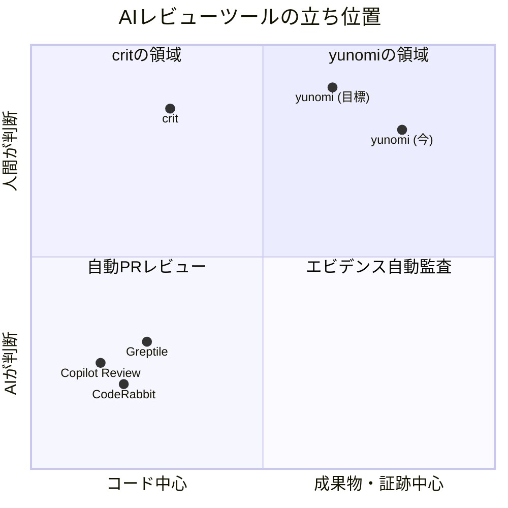
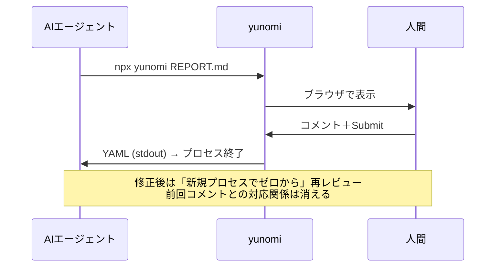
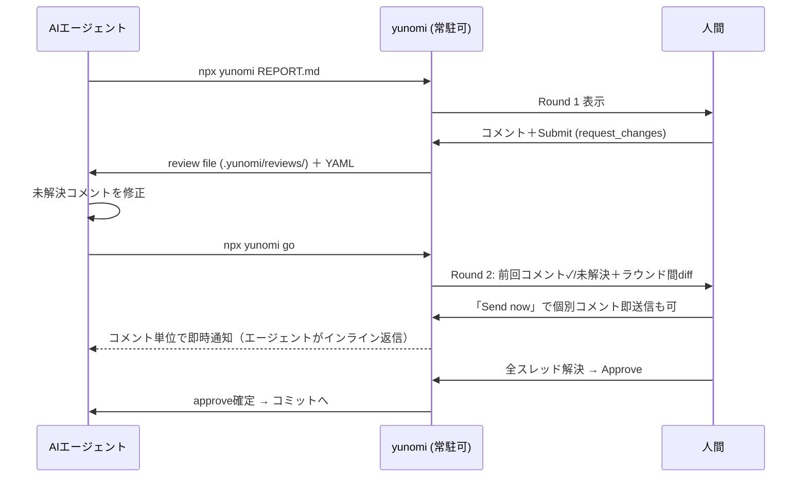
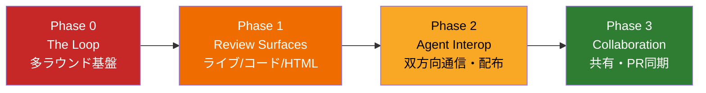

# yunomi PLAN — AIネイティブレビューツールへの進化ロードマップ

> **依頼内容**: 「yunomiが crit などの今流行っているAIネイティブなレビューツールになるために必要な機能を全部洗い出し、PLANとして保存する。READMEもそれを期待させる内容に更新する」（2026-07-07）

---

## 1. 現在地 — yunomi と競合の思想マップ

2026年のAIコードレビュー市場は大きく2系統に分かれている：

- **AIがレビューする側**（CodeRabbit / Greptile / Copilot Code Review / Graphite）— PRに自動コメントするボット
- **人間がAIの成果物をレビューする側**（crit / kevindutra-crit / **yunomi**）— エージェント出力への人間の判断ゲート

yunomiは後者。そして後者で今一番勢いがあるのが [crit](https://crit.md/)（Go製・700+ stars・v0.17系・63リリース）。

**yunomiの譲れない強み（守るもの）**：

- **Evidence-first文化**: コードではなく REPORT.md（意図・変更・証跡）をレビューさせる思想。メディア規律チェック、動画タイムライン、Mermaidフルスクリーンなど「証跡を読む体験」は crit に無い
- **ゼロインストール自己教育**: `npx yunomi`（引数なし）でスキル文書を出力しエージェントが自習する仕掛け
- **承認ゲートとしての明確さ**: Approve / Request Changes という意思決定が構造化YAMLで返る

**critに学ぶべき決定的ギャップ（獲るもの）**：多ラウンドループ、レビュー状態の永続化、ライブプロキシ、エージェント逆方向通信。

## 2. 機能ギャップ比較（crit vs yunomi 現状）

| # | 機能 | crit | yunomi 現状 | 判定 |
|---|------|------|-------------|------|
| 1 | 多ラウンドレビューループ（ラウンド間diff） | ✅ `crit go` | ❌ Submitで終了、毎回まっさら | **P0** |
| 2 | コメントスレッド永続化（resolved/unresolved管理） | ✅ ラウンド跨ぎで保持 | △ localStorage自動保存のみ | **P0** |
| 3 | レビュー状態のファイル永続化（ブランチ単位隔離） | ✅ `~/.crit/reviews/` JSON | △ 履歴ファイルのみ、再開不可 | **P0** |
| 4 | レビュー結果のファイル受け渡し（stdout非依存） | ✅ review file | ❌ stdout YAMLのみ（プロセス死で消失） | **P0** |
| 5 | 変更ファイル自動検出（引数なし起動 in repo） | ✅ git/jj/sapling | ❌ 引数なし＝スキル出力 | **P1** |
| 6 | ライブアプリレビュー（devサーバープロキシ＋DOMピンコメント） | ✅ `crit live <url>` | ❌ | **P1** |
| 7 | 静的HTMLプレビューレビュー | ✅ iframe sandbox | △ sanitize済みHTML断片のみ | **P1** |
| 8 | エージェントへの即時逆通信（コメント"Send now"→インライン返信） | ✅ 実験的 | ❌ | **P1** |
| 9 | プログラマティックコメント（`crit comment file:line 'text'`） | ✅ | ❌ | **P2** |
| 10 | マルチエージェントインストーラ（`crit install cursor` 等12種） | ✅ | △ Claude plugin＋npx skills手順のみ | **P2** |
| 11 | GitHub PR双方向同期（pull/push） | ✅ | ❌ | **P2** |
| 12 | レビュー共有URL（非同期・色分け複数人） | ✅ `crit share` | ❌ | **P3** |
| 13 | Vimキーバインド・キーボード完結レビュー | ✅ | △ 一部ショートカットのみ | **P2** |
| 14 | status / stats / cleanup 系メタコマンド | ✅ | ❌ | **P3** |
| 15 | Markdown報告書・証跡メディアレビュー体験 | △ Plans&Docsのみ | ✅ **圧勝領域** | 維持強化 |
| 16 | 承認ワークフロー（Approve/Request Changes＋skill配布） | ❌ | ✅ **圧勝領域** | 維持強化 |

## 3. 目標像 — "The Review Loop"

yunomi 3.0のコンセプトは **「一杯で終わらないお茶」**。Submitはループの終わりではなく、次のラウンドの始まり。

### Before（現在のフロー）

### After（yunomi 3.0のフロー）

## 4. ロードマップ（フェーズ別・全機能）

### Phase 0: The Loop — 多ラウンドレビュー基盤（最優先・critとの決定的差分）

crit最大の差別化ポイント。ここが無いと「AIネイティブ」を名乗れない。

#### 0-1. レビュー状態のファイル永続化

- `.yunomi/reviews/<branch>/review.json` にラウンド・コメント・解決状態を保存（ブランチ単位隔離）
- stdout YAML出力は後方互換で維持しつつ、**review fileを正式な受け渡し経路に昇格**（プロセスが死んでもレビュー結果が消えない）
- 受け入れ条件: ターミナルを閉じても翌日 `yunomi go` でレビューを再開できる

#### 0-2. `yunomi go` — ラウンド更新コマンド

- エージェントが修正完了後に実行 → ブラウザが新ラウンドを開始し、**前ラウンドからのdiff**を表示
- 受け入れ条件: Round 2で「前回コメント箇所が実際どう変わったか」が1画面で分かる

#### 0-3. コメントスレッド（resolved / unresolved）

- コメントはラウンドを跨いで行に張り付き続ける。エージェントの対応報告がスレッド返信として表示される
- **人間が✓を押すまで未解決のまま**。全解決までApproveボタンは要確認状態
- 受け入れ条件: 「直したつもり」で未解決コメントが闇に消えることが構造的に不可能

#### 0-4. Submit後もサーバー継続（`--loop` / デフォルト化検討）

- request_changes時はexitせず待機し、`yunomi go` で同一URLのままラウンド更新（タブ開き直し不要）
- approve時のみexit。既存の「exit＝完了通知」フローと両立させる

#### 0-5. スキル文書の全面改訂

- `npx yunomi`（引数なし）が教える内容をループ前提に更新：review fileの読み方・`go`の叩き方・スレッド解決の作法

### Phase 1: Review Surfaces — レビューできる対象を拡げる

- **1-1. 変更ファイル自動検出**: git repo内で `yunomi review`（または引数なしの文脈判定）→ working tree / branch diffを自動収集して一括レビュー。git worktree・jj対応
- **1-2. ライブアプリレビュー `yunomi live <url>`**: ローカルdevサーバーをプロキシし、**動いているUIのDOM要素に直接ピンコメント**。要素セレクタ＋スクショがreview fileに構造化されて入る（エージェントが曖昧さゼロで修正対象を特定できる）
- **1-3. 静的HTMLプレビュー `yunomi page.html`**: 生成LP等をiframe sandboxでレンダリングし、要素クリックでコメント。関連アセット自動配信
- **1-4. コードレビュー強化**: diffビューにファイルツリー・viewed済みチェック・コメントのラウンド追従を追加。「REPORT.mdが主・diffが従」の思想は維持（コードだけ見せる運用は引き続き非推奨）

### Phase 2: Agent Interop — エージェントとの双方向化

- **2-1. Live agent response（"Send now"）**: コメント単位で即時エージェント送信 → エージェントが読んで修正 or インライン返信 → レビュー継続中にスレッドが伸びる。`agent_cmd` はグローバル設定のみ許可（critと同じくリポジトリ設定からのコマンド注入を防ぐ）
- **2-2. `yunomi comment <file:line> '<text>'`**: CLIからのプログラマティックコメント追加（エージェント同士のクロスレビュー、CI連携に使える）
- **2-3. `yunomi install <agent>`**: claude / codex / cursor / opencode / cline / gemini 等へSKILL.md・スラッシュコマンドをワンコマンド配布（現在のnpx skills手順を内蔵化）
- **2-4. `yunomi mcp`**: MCPサーバーモード。review状態の取得・コメント追加・ラウンド更新をMCPツールとして公開
- **2-5. 構造化コンテキストの強化**: コメントYAML/JSONに周辺行スニペット・DOMセレクタ・添付画像パスを含め、エージェントが「探さずに直せる」情報密度にする

### Phase 3: Collaboration — 人間側のスケール

- **3-1. `yunomi share`**: レビューの読み取り専用共有URL（明示操作時のみ外部送信。デフォルトは127.0.0.1バインドのローカル完結を堅持）
- **3-2. GitHub PR同期 `yunomi pull / push`**: PRコメント⇔yunomiコメントの双方向同期
- **3-3. Vimキーバインド・キーボード完結レビュー**: j/k移動・c でコメント・r で解決・Cmd+Enter Submit
- **3-4. `yunomi status / stats / cleanup`**: 進行中レビュー一覧・承認率/ラウンド数統計・古いレビュー掃除
- **3-5. レビューテンプレート**: REPORT.mdの雛形をチーム定義できる（受け入れ条件チェックリスト強制など）

## 5. 実装順序と根拠

| 順位 | 対象 | 根拠 |
|------|------|------|
| 1 | Phase 0 全部 | critの核でありyunomiの唯一の構造的弱点。「Submitで終わり」から「承認まで回るループ」への転換はコンセプト刷新（yunomi 3.0）に値する |
| 2 | 1-2 ライブアプリレビュー | yunomiユーザーの実運用（webapp検証）で最も刺さる。証跡文化と相性が良い（ピンコメント＝生きた証跡） |
| 3 | 2-1〜2-2 双方向通信 | ループの往復レイテンシを「Submit待ち」から「コメント即時」へ短縮 |
| 4 | 残り | 差別化というより到達点の網羅 |

**技術メモ**: 実装はすべて既存のMoonBit単一構成（`v2/`）上で行う。review file形式はJSON（機械可読・ブランチ隔離）＋stdout YAML互換。`yunomi go` はロックファイル機構（既存のサーバー検出）を拡張して常駐サーバーへ通知する。

## 6. 参考資料

- [crit 公式](https://crit.md/) / [GitHub tomasz-tomczyk/crit](https://github.com/tomasz-tomczyk/crit) / [AI Review Loop解説](https://crit.md/features/ai-review-loop)
- [kevindutra/crit（TUI版）](https://github.com/kevindutra/crit)
- [Cloudflare: Orchestrating AI Code Review at scale](https://blog.cloudflare.com/ai-code-review/)（人間のescape hatch設計）
- [Sourcegraph: Automated Code Review Tools 2026](https://sourcegraph.com/blog/automated-code-review-tools)（市場俯瞰）
