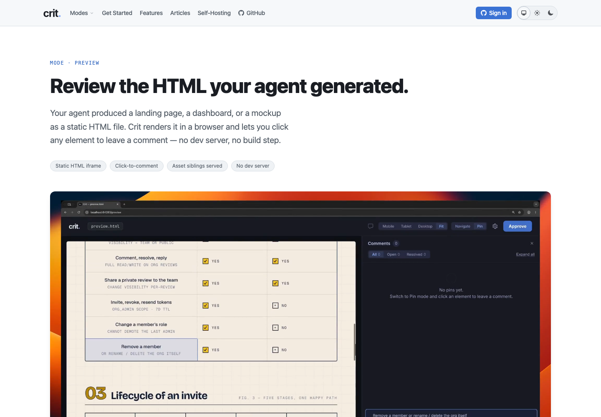
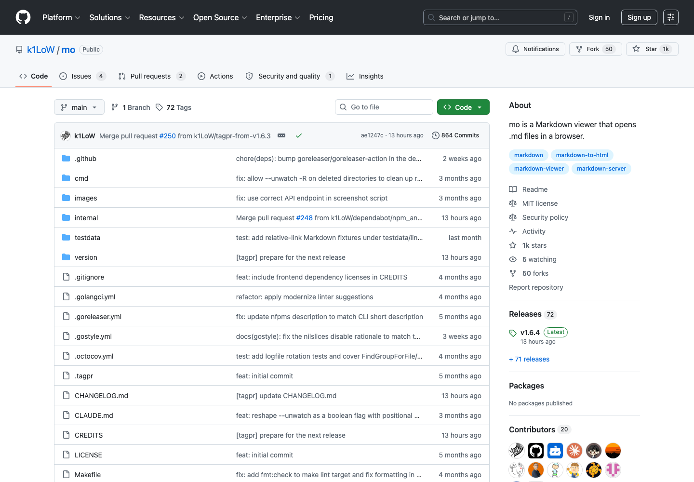
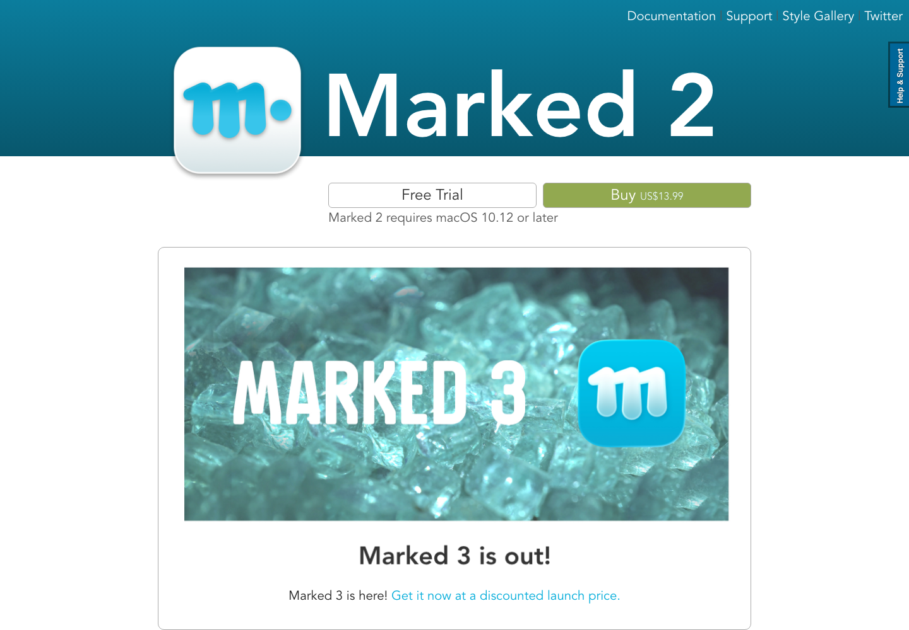
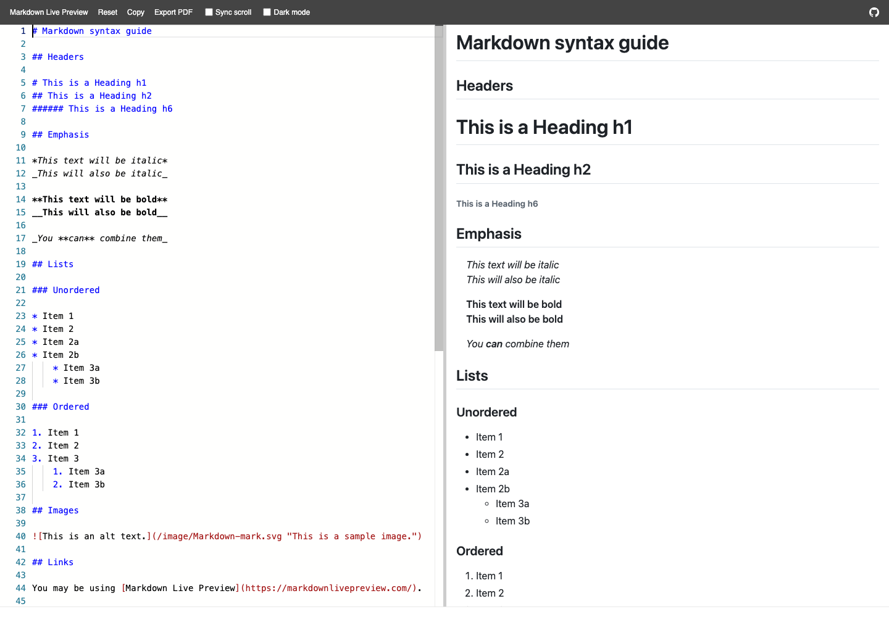
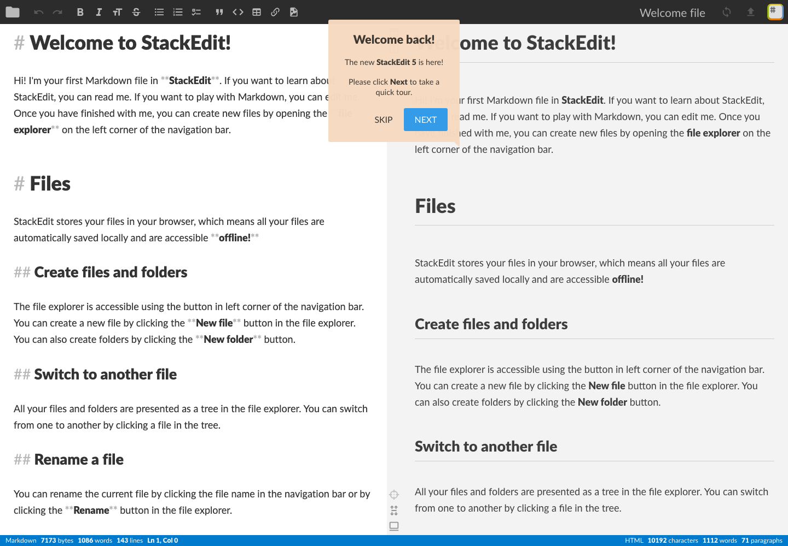
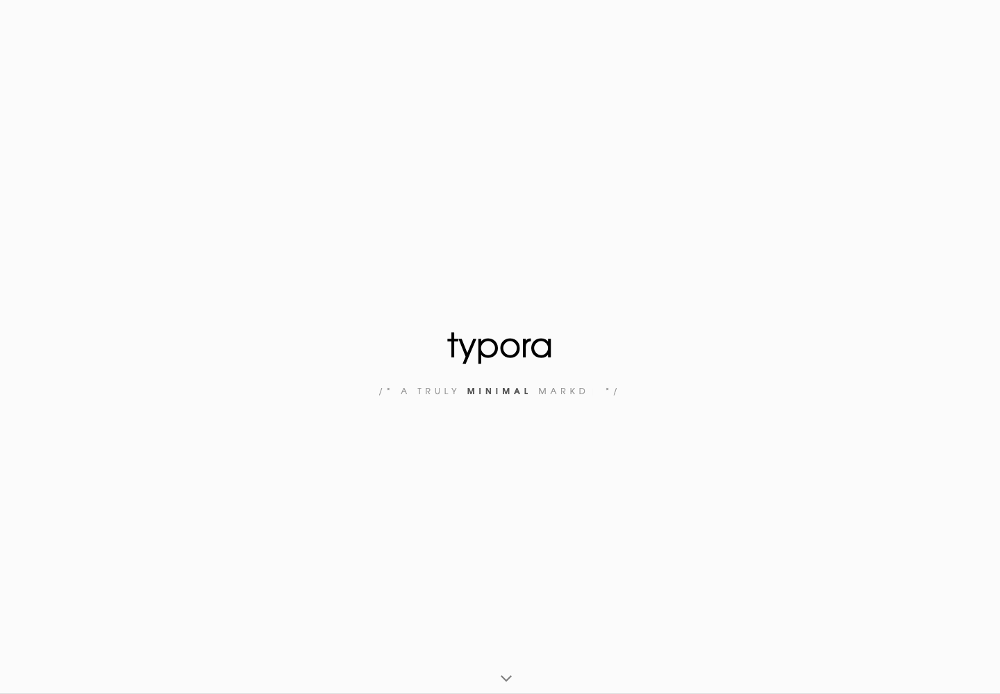
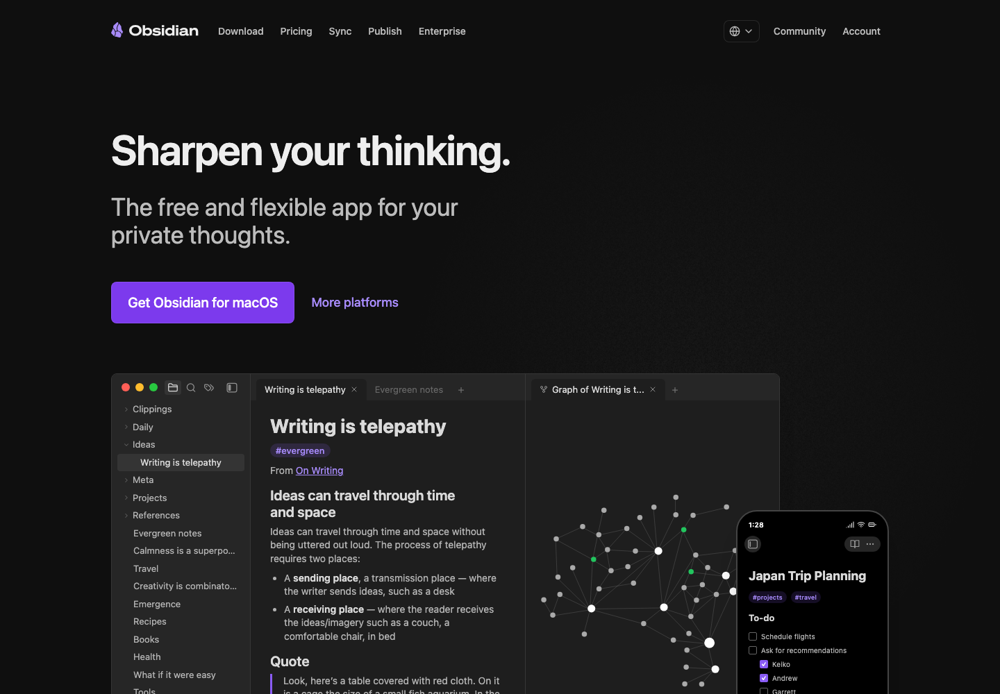

# yunomi review loop design references

## 元の依頼

「全体的にのっぺりして見づらい。Crit や mo など、他の競合 Markdown 即席表示ツール等のデザインを探してきて、スクショまたはホームページ画像を取得し、表の中身に画像を埋め込む形で羅列して yunomi して。」

## なぜ見るか

今の yunomi review loop は、中央寄せや余計な横線は消えた一方で、全体が平坦に見え、どこが「確認すべき課題」なのか視線の引っかかりが弱い。  
ここでは、Markdown/HTML の即席プレビュー、レビュー、閲覧ツールの画面を並べ、yunomi に持ち帰るべき視覚パターンを見ます。

## 取得条件

- 取得日: 2026-07-14
- 取得方法: 公式サイトまたは公式GitHubページを Playwright でスクリーンショット
- 画像保存先: `docs/yunomi-design-refs/`

## 競合・近接ツールの見た目一覧

| ツール | 取得画像 | 何を見るか | yunomi への示唆 |
|---|---|---|---|
| [Crit Preview](https://crit.md/modes/preview) |  | レビュー対象、コメント、操作の関係が「レビュー画面」としてまとまっている。装飾よりも、レビュー行為の文脈を先に見せている。 | review loop は本文に溶かし込みすぎず、「未解決確認項目の作業台」としてヘッダー、状態、項目リストを明確に分ける。 |
| [mo](https://github.com/k1LoW/mo) |  | README中心の情報密度。コード例、用途、オプションが縦に読みやすく、余計なUI装飾がない。 | yunomi の確認項目も、余白だけで間延びさせず、行ラベル・本文・補助情報を読み物として詰める。 |
| [Marked 2](https://marked2app.com/) |  | プレビュー専用アプリとして、見出し、説明、CTA、画像の階層が明確。画面の主役がすぐ分かる。 | review loop 上部は「確認項目」「未解決数」「今回の指摘」をもっと強い階層で見せる。 |
| [Markdown Live Preview](https://markdownlivepreview.com/) |  | エディタとプレビューの2ペイン。操作ボタンは小さく、主領域は入力と出力に集中している。 | yunomi でもメタ情報を増やしすぎず、依頼・AI返信・対象の3要素を横断比較しやすくする。 |
| [StackEdit](https://stackedit.io/app#) |  | 左右分割とツールバーで、編集・プレビュー・同期状態を分離している。密度は高いが役割が分かる。 | review loop は1枚の平坦な表ではなく、状態列・本文列・操作列の役割分担を作ると見やすい。 |
| [Typora](https://typora.io/) |  | 極端に余白を使ったミニマル表現。ブランド画面としては強いが、レビュー作業には情報量が足りない。 | yunomi は Typora 的な余白主体に寄せすぎると「のっぺり」する。確認画面では密度と区切りが必要。 |
| [Obsidian](https://obsidian.md/) |  | 複数ペイン、サイドバー、カード、関係性の視覚化。情報の居場所が複数ある。 | yunomi はサイドバーを増やすより、review loop 内で「状態」「依頼」「返信」「対象」の居場所を固定する方がよい。 |

## yunomi の次デザイン案

## 緑ベースをやめるための人気カラースキーム候補

緑を主役にせず、Markdownレビュー画面として使いやすい定番テーマを10案並べます。  
GitHub Primer / Catppuccin / Nord / Dracula / Tokyo Night / Solarized / One Dark は、コードエディタ、ドキュメント、開発者向けUIで広く使われる配色です。

| 候補 | スウォッチ | ベース | yunomi に合う理由 | 注意点 |
|---|---|---|---|---|
| GitHub Primer Light |  | 白・薄灰・青 | GitHubレビューに近く、Markdown/差分/コメントの文脈に馴染む。最も無難。 | 個性は弱い。 |
| GitHub Primer Dark |  | 黒紺・青・紫 | 開発者向けレビュー画面として自然。コードや差分が締まる。 | 明るい環境では重い。 |
| Catppuccin Latte |  | 淡灰・青・紫・赤 | 明るいが緑っぽくならず、柔らかいレビューUIにできる。 | 甘く寄せすぎると業務画面感が薄れる。 |
| Catppuccin Mocha |  | 暗紺・青・紫・赤 | 暗色でも圧が弱く、コメントと返信の差を作りやすい。 | 彩度を上げすぎない。 |
| Nord |  | 寒色グレー・水色・紫 | 静かで読みやすい。緑よりも落ち着いた業務ツール感が出る。 | 低コントラストになりやすい。 |
| Dracula |  | 暗紫・シアン・ピンク | 状態チップやAI返信を目立たせやすい。のっぺり回避に強い。 | 派手にすると玩具っぽい。 |
| Tokyo Night |  | 濃紺・青・紫・赤橙 | Crit寄りのシャープなレビュー画面にしやすい。 | 全体を暗くしすぎるとMarkdown本文が重い。 |
| Solarized Light |  | 生成り・青・紫・赤 | 長文Markdownに強い。白背景より目が疲れにくい。 | ベージュが古く見える可能性。 |
| Solarized Dark |  | 青黒・青・紫・橙 | エンジニア向け定番。差分とコードに合う。 | 既視感が強い。 |
| One Dark |  | グレー黒・青・紫・赤橙 | VS Code/Atom系の定番で、コードレビュー文脈に自然。 | yunomi全体を暗色化するならコントラスト設計が必要。 |

## 配色の推奨順位

| 順位 | 推奨配色 | 理由 |
|---|---|---|
| 1 | GitHub Primer Light | レビュー、コメント、Markdown、差分の文脈に一番近く、緑の気持ち悪さを消せる。 |
| 2 | Tokyo Night | Critっぽいシャープさを出しやすく、状態チップやAI返信の視認性を作れる。 |
| 3 | Catppuccin Latte | 明るいまま柔らかくできる。緑より安心感がある。 |
| 4 | One Dark | 開発者向けの既視感があり、コード・差分表示に強い。 |

避けたい方向は、現在のような「薄い緑を画面全体に敷く」ことです。緑は成功・完了・承認の局所アクセントに留め、通常状態のベースカラーには使わない方がよいです。

| 改善軸 | 今の弱さ | 取り入れる方向 |
|---|---|---|
| 視線の始点 | `確認項目` と `未解決数` が同じ密度で埋もれる | Crit/Marked 2 のように、上部に「未解決レビューの作業台」と分かる強いヘッダーを置く |
| 項目の密度 | 各項目が文章として続き、どこを見ればいいか迷う | StackEdit/mo のように、ラベル列と本文列を保ちつつ、項目ごとの状態を左端に固定する |
| 返信の存在 | AI返信はあるが、課題に対する回答としての目印が弱い | `AIからの返信` を小見出しではなく、回答ブロックとして少し背景差を付ける |
| 区切り | 横線を消すと全体がのっぺりする | 意味のない hr ではなく、項目カードの左端アクセント、状態チップ、行間の濃淡で区切る |
| 操作 | `確認して解決` が右下に浮き、読み順から外れる | 項目ヘッダー右側に状態と解決操作を寄せ、確認→解決の流れにする |

## 推奨する方向

次の実装では、現在の「全幅フラットリスト」は維持しつつ、各確認項目を次の構造に寄せるのがよいです。

1. 上部: `確認項目` / `未解決 2 件` / `今回の指摘` を1つのレビュー作業ヘッダーにまとめる
2. 各項目: 左端に細い状態アクセント、中央に依頼とAI返信、右上に `未解決 + 返信済み` と `確認して解決`
3. 対象本文: 破線やhrではなく、淡い背景の `対象` ブロックとして下段に折りたたむ
4. 差分: 常時見せず、最後に `前回提出時 → 現在の全体差分` として補助情報に閉じる
