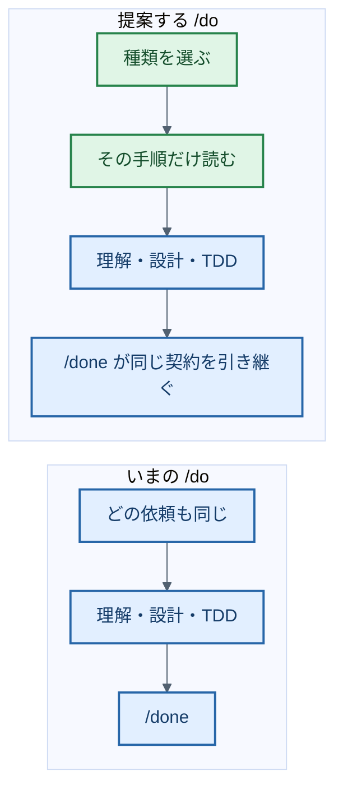
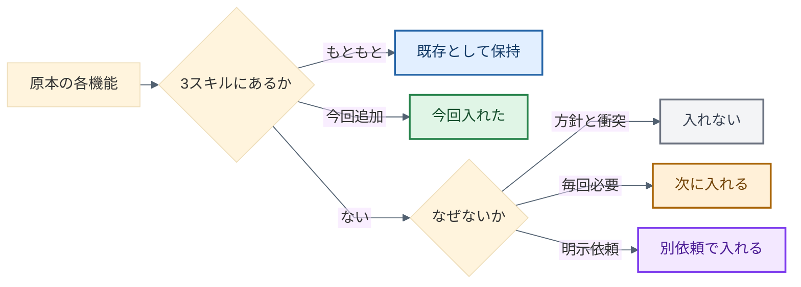
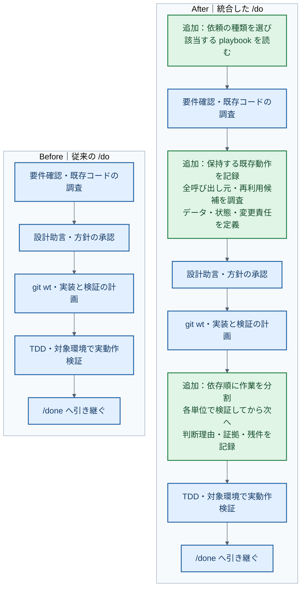
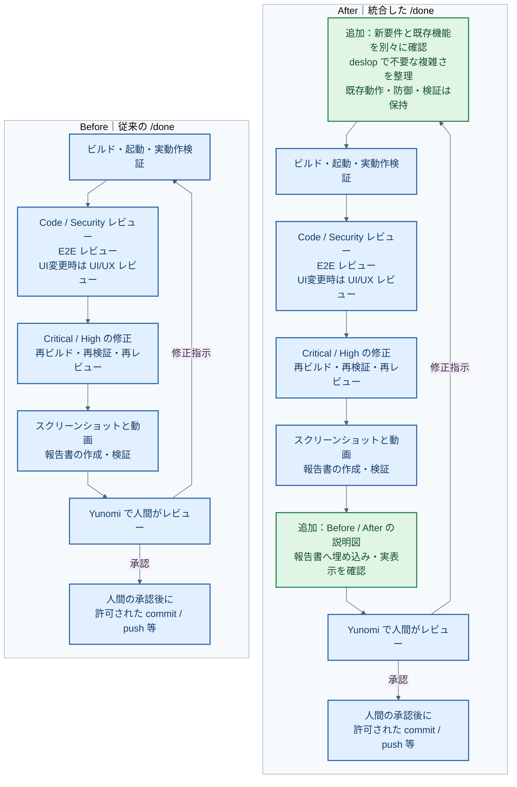
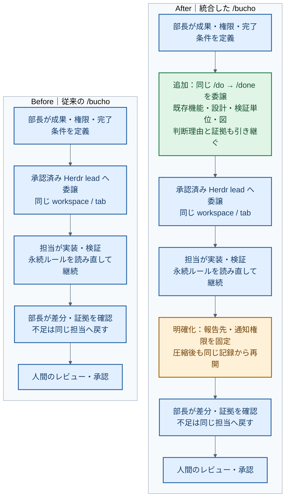

## 背景・目的

> なにを入れなにを入れてないのか？そして入れてないならなぜいれなかったのか教えてよ。MECEでね。

**答えはこれです。** いまの `/do`・`/done`・`/bucho` は、Yunomiがもともと持っていた完了条件に、Ponytailの再利用順とP-Stackの一部原則を足した状態です。P-Stackの中心である「仕事の種類に合わせて手順を選ぶ」は入っていません。deslopは差分整理の一工程で、中心ではありません。

前回の79項目表は原本の棚卸しとしては残します。ただし「一部採用」が47件あり、入れたものと足りないものが混ざっていました。この節では同じ項目を、**いまある／今回足した／入れない／次に入れる／別依頼で入れる** のどれか一つに分けます。後段の3つのMermaidは現在の実装です。下の入れ方は未実装の提案です。

## 対応・判断理由

### いま決めてほしいこと

推奨は「日常開発の中核だけ次に入れる」です。3スキル本文は毎回読むので、性能解析や積層PRまで同時に足すと、入口一本化の意味が薄れます。チェックした範囲だけ次の実装に進みます。

- [x] 日常開発の中核だけ次に入れる。仕事別の手順選択、過去の設計理由の調査、構造が決まらないときの設計案比較、再実行しても壊れない契約、差分の分類整理。第三者スクリプトは追加しない
- [ ] 検証手順の保守、承認後の振り返り、全体監査、積層PRの運転も同時に入れる。3入口が長くなり、明示依頼の仕事まで毎回の手順に混ざる
- [ ] いまの3スキルで止める。入口統一と再利用・既存機能保持だけで運用し、P-Stackの手順選択は入れない
- [ ] 入れないもの（スクリプト、品質モード、Benny、自動納品、上流ベンチマークの転用、追加モデル設定）はこのまま確定する

### P-Stack提案：種類を選んでから動く

P-Stackから取るのは実行基盤ではなく、**最初に仕事の種類を決めて、その手順だけを読む**ことです。入口は `/do` のままです。専用コマンドは増やしません。パッケージもスクリプトも追加しません。

いまの `/do` は、調査でも不具合でも新機能でも同じ一本道です。P-Stack側では、調査は読取専用、不具合は再現してから直し、新機能は仕組みを読んでから案を比較します。この差を Markdown に書きます。

| 依頼の様子 | `/do` が読む手順 | 既存の `/do` に足す動き | 取らない上流の細部 |
|---|---|---|---|
| 仕組みや理由を聞くだけ | `playbooks/investigation.md` | 編集しない。出典と推論を分ける。過去の理由は git・PR から探す | 7系統のMCP調査員、専用の why コマンド |
| 壊れている | `playbooks/bug-fix.md` | 同じ面で再現する。仮説を観測で落とす。直したら同じ面で確認する | 必須サブエージェント、TDDを安いテストだけにする |
| 新しい動き | `playbooks/feature.md` | 先に実フローを読む。構造が決まらなければ案を2つ以上残す。単位ごとに検証する | 実装を必ず子に出す、arena 必須、自動コミット |
| 動きは変えず形を変える | `playbooks/refactoring.md` | 変更前後の同じ結果を確認する。既存機能は残す | APIの自動廃止 |
| 遅い | `playbooks/perf-issue.md` | 既存の測り方で前後を残す。原因への修正だけ入れる | 専用プロファイラや control の導入 |
| スキル自体を変える | `playbooks/authoring-a-skill.md` | このリポジトリでは作成・配布一致・通知契約まで見る | 上流の skill-creator 実行コード |
| 途中から再開する | `playbooks/session-pickup.md` | 同じ記録と残件から続ける。種類が変わっていれば選び直す | 自動 WIP コミット |
| どれにも当てはまらない | `/do` 本文に手順を先に書く | その場しのぎで実装しない | 常駐ループ、依頼外の仕事の自動追加 |

`/done` は種類を選び直しません。選ばれた手順の完了条件を引き継ぎます。調査なら差分がないことを確認します。実装なら新要件と既存機能を分けて確認します。

`/bucho` は、選んだ種類と読んだ手順ファイルを委譲契約に書きます。担当の「完了」だけでは通しません。

**P-Stackから入れないもの**は、専用モデル、必須の子エージェント、候補の独立生成（arena）、常時の多人数、積層PR、毎回の PR 自動作成、7つの調査員です。行動が必要なら、既存の Herdr と git / `gh` と Markdown で足ります。

置き場所は次だけです。

- `/do` 本文の先頭近くに、上の対応表
- `plugin/skills/do/playbooks/` に7ファイル
- 調査と不具合から参照する `plugin/skills/do/why.md`（git blame / log / あるなら PR。記録と推論を分ける。独立コマンドにしない）
- `/done` に「選ばれた手順の完了条件を引き継ぐ」
- `/bucho` に「選んだ種類と読んだ手順を渡す」

- [x] このP-Stack提案どおり、7手順と why を Markdown で入れる
- [ ] 調査・不具合・新機能の3手順だけ先に入れる。再開や性能は後回し
- [ ] 提案を直してからにする。まだスキル本文は変えない

### なぜ deslop だけでは足りないか

P-Stackが参照する deslop は本体ではなく、別パッケージ `cursor-team-kit` のスキルです。[上流のPR作成手順](https://github.com/cursor/plugins/blob/c1c0a32802223f4be824112dd83d33ad29a8b26c/pstack/skills/poteto-mode/playbooks/opening-a-pr.md)に「commit前」と書いてあります。前回、採用可能とされた一項目から説明を組み立てたため、重要度の順ではありませんでした。

P-Stackの中心は [poteto-mode](https://github.com/cursor/plugins/blob/c1c0a32802223f4be824112dd83d33ad29a8b26c/pstack/skills/poteto-mode/SKILL.md) です。調査・不具合・新機能・構造変更・性能・スキル変更・再開のどれかを先に選び、その手順と専門スキルを読んでから動きます。Ponytailの中心は、要求を理解してから既存実装→標準機能→ネイティブ→導入済み依存→新規コードの順で試し、全呼出元の共通原因を直すことです。[P-Stack原本](https://github.com/cursor/plugins/blob/c1c0a32802223f4be824112dd83d33ad29a8b26c/pstack/README.md)、[Ponytail原本](https://github.com/DietrichGebert/ponytail/blob/e3ba2aa6f1e6f0bc4d69eb09c9f0d0a93af56156/skills/ponytail/SKILL.md)。

### 採否の分け方

原本の各項目は、次の5つのどれか一つです。重複しません。後段の79項目表は原本照合用で、こちらの判断を上書きしません。

| 区分 | 意味 | 入っている／入っていない中身 | 入れなかった理由 |
|---|---|---|---|
| 既存として保持 | 統合前からYunomiの義務。P-Stackから得た新機能ではない | 要求確認、t-wada TDD、実ブラウザ／API／端末での証明、Code・Security／E2E／UI/UX、重大指摘の再レビュー、スクショと動画、人間の承認、Herdr委譲、説明を明瞭にする規則 | 対象外ではない。新規採用にも数えない |
| 今回入れた | 3スキル本文に中心の行動がある | 既存動作の記録と回帰、再利用順、全呼出元と共通原因、データ・状態・変更責任、依存順の単位検証、短い判断記録と再開、説明図、差分の deslop、同じ `/do` → `/done` の委譲 | ここまでは入った。手順の選択そのものは含まれない |
| 入れない | 現行の品質・権限・入口一本化と衝突する | 第三者スクリプトとライブラリ、P-Stack用モデル設定、Bot UI、Benny、品質モード lite/full/ultra、検証縮小、コメントの積極削除、APIの自動廃止、自動納品、worktree掃除、上流ベンチマーク数値の転用 | 既存機能・防御・承認済み実行系・依頼範囲を守るため。行動まで不要という意味ではない |
| 次に入れる | 検討漏れ。日常の `/do` `/done` `/bucho` に載せる | 仕事別の手順選択、過去の設計理由の調査、構造が決まらないときの複数案比較、再実行・中断復旧の契約、差分指摘の分類、スキル変更時の作成手順 | 「スクリプトを入れない」は理由にならない。Markdownと既存Herdrで足りる |
| 別依頼で入れる | 検討漏れ。毎回読む本文には載せない | 独立した候補生成、目的別の並列、検証スキルの生成と保守、承認後の規則反映、全体監査と負債台帳、性能の継続改善、実行中／保存トレース解析、積層PRの運転 | 有用だが、明示された仕事の手順にする。毎回の3入口を膨らませない |

### 今回入れたものと、もともとあったものの境目

**今回入れたもの**は、次に限られます。

- `/do`：既存動作の保持記録、全呼出元、再利用順、データ・状態・所有者、依存順の単位検証、判断理由と残件、説明図の計画
- `/done`：新要件と既存機能を分けて確認、今回差分の deslop、説明図の埋め込みと実表示確認
- `/bucho`：同じ `/do` → `/done` を渡す、判断と証拠の引継ぎ、報告先の固定

**もともとあったもの**を、今回の成果として数えません。TDD、実動作検証、専門レビュー、人間の承認、Herdr委譲です。

**入っていない中心**は、仕事の種類を選んで手順ファイルを読むことです。入口を `/do` に揃えたことと、調査・不具合・新機能で読むものが変わることは別です。

### 入れてない理由（なぜ、の排他）

入れてない項目は、次のどれか一つです。「一部入っているから採用」とはしません。

1. **品質と権限を守るため入れない。** 簡易版、検証縮小、防御やコメントの一律削除、既存APIの自動廃止、承認なしの破壊的操作。
2. **実行基盤を増やさないため入れない。** P-Stack/Ponytailのスクリプト、hooks、MCP、追加モデル、Benny、Bot UI。行動が必要なら既存HerdrとMarkdownへ接続する。
3. **入口を増やさないため入れない。** 個人モード、品質モード、独立コマンドの増設。分析は使えても、入口は `/do` `/done` `/bucho` のまま。
4. **依頼されていないため入れない。** 全体掃除、外部報告の自動受付、上流ベンチマークをYunomiの効果として表示すること。
5. **検討漏れ。次に入れる。** 手順選択、過去理由の調査、設計案比較、再実行契約、差分の分類、スキル変更手順。
6. **検討漏れ。別依頼。** 全体監査、負債台帳、検証スキル保守、振り返りの規則反映、積層PR、性能キャンペーン。

### 次に入れる場合の具体的な入れ方

未実装です。承認した範囲だけ、既存レビューと人間承認を残して足します。79項目を毎回読ませません。

| 置き場所 | 追加する本文 | 発動するとき | 確認する動作 |
|---|---|---|---|
| `/do` 本文の先頭近く | 依頼を調査／不具合／新機能／構造変更／性能／スキル変更／再開のどれかに当て、該当Markdownを読んでから動く。該当なしなら手順自体を先に書く。調査は編集しない | 新しい依頼、または再開 | 選んだ種類と、実際に読んだファイルが記録に残る |
| `/do` が条件で読む Markdown | `plugin/skills/do/playbooks/` に、調査・不具合・新機能・構造変更・性能・スキル変更・再開を置く。過去の設計理由は Git・PR・記録から探し、出典と推論を分ける。構造が決まらなければ案を2つ以上作り、共通の評価軸と不採用理由を残す。変更操作は二重実行と中断後も同じ正しい状態へ収束させる | 選ばれた種類の仕事 | 調査でファイルが変わらない。設計案と比較結果がある。再実行しても壊れない |
| `/done` の差分整理 | 重複／標準で足りる／ネイティブで足りる／今の要求に不要、に分類して指摘する。範囲内の修正だけ行い、必要な防御は残す | 完了工程 | 分類付きの指摘か、「整理不要」の明示。既存機能が残る |
| `/bucho` の委譲契約 | 同じ手順選択と判断記録を渡す。独立した調査や候補があるときは欠落と対立を照合してから人間レビューへ進む | 明示された委譲 | 担当の完了宣言だけで通さない。欠落が戻される |
| 独立コマンド | 作らない | なし | 入口は3つのまま |

明示依頼があるまで本文に載せないものは、全体監査、負債の改善条件、検証スキルの生成と保守、承認後の振り返り、積層PR、性能の継続改善です。必要になったら同じ置き方で足せます。

### 開発工程ごとの現在地

この表は上の5区分の要約です。原本の全項目は後段にあります。**既存機能を新規採用に数えません。**

| 工程 | いまあるもの | 次に入れる／入れない |
|---|---|---|
| 依頼を受ける | 今回：`/do` に入口を統一 | **次に入れる：** 仕事別の手順選択。入口統一は手順選択の代替ではない |
| 実態と理由を調べる | 今回：全呼出元・共通原因・観測 | **次に入れる：** 過去の設計理由。性能の専用解析は別依頼 |
| 設計を選ぶ | 今回：再利用順、データ・状態・責任。既存：設計助言 | **次に入れる：** 異なる構造の候補と不採用理由。独立した候補生成は別依頼 |
| 実装する | 今回：依存順・単位検証。既存：TDD | **次に入れる：** 再実行しても壊れない契約。TDDの弱体化は入れない |
| 製品の機能を検証する | 既存：実動作と専門レビュー。今回：既存機能保持 | **別依頼：** 製品の機能一覧と検証手順の保守。既存レビューは保持 |
| 複雑さと負債を確認する | 今回：差分の整理 | **次に入れる：** 差分指摘の分類。全体監査と負債台帳は別依頼 |
| 担当を分けて進める | 既存：Herdr。今回：同じ `/do` → `/done` | **次に入れる：** 独立結果の欠落照合。常時の多人数起動は入れない |
| 提出・納品する | 既存：証拠と人間承認。今回：説明図 | **入れない：** 自動納品。積層PR運転は別依頼 |
| 次の仕事へつなぐ | 今回：短い判断記録と再開 | **別依頼：** 振り返りを規則へ戻す循環。同条件の効果測定は未実施 |

### 入口と使い分け

| 入口 | Before：統合前 | After：現在 |
|---|---|---|
| 開発を始める | `/do` と `tiny-do` の使い分け | **`/do` に一本化**。要件確認から `/done` の人間レビューまで継続 |
| 既存作業を仕上げる | `/done` と `tiny-done`、レビュー水準の選択 | **`/done` に一本化**。対象に必要な検証・証拠・承認を実施 |
| 担当へ任せる | `/bucho` で成果全体を委譲 | **同じ `/do → /done` を委譲**。部長が差分と証拠を確認 |
| スキルの原本 | dotfiles側で本文を管理 | **Yunomiに原本、各環境には同じ本文を配布** |

tinyは有効なスキル一覧から外し、原文を退避済みです。要件・検証・品質を減らす経路は設けていません。

**図の凡例：青＝既存機能を保持、緑＝追加、橙＝既存手順の明確化。左がBefore、右がAfterです。** Beforeは統合前の手順、Afterは修正済みスキルの手順を示します。

### /do：既存機能を把握し、設計してから実装する

設計助言はCode & Security、テストに影響するときはE2E、UIに影響するときはUI/UXが対象です。技術的な不明点は実際の観測で確かめ、未確定の意図や選択を人間に確認します。

### /done：新要件と既存機能の両方を確かめて提出する

**最終セキュリティレビューは維持しています。** 認証・認可、秘密情報、XSS・インジェクション、型・例外処理などを確認します。E2Eは実際の操作と保存結果を確認し、モックや認証迂回は禁止です。UI変更時のアクセシビリティ確認も残っています。Backendの実テスト・coverage、MobileのMaestro assertions・各ステップ画像も対象に応じて実施します。

### /bucho：同じ完了条件を担当へ渡し、部長が成果を確認する

担当は現在の環境で承認済みのHerdr実行系を使います。担当からの「完了」という報告だけで済ませず、部長が差分・実行結果・図・動画を確認してから人間のレビューへ進みます。

### 全件一覧の範囲と読み方

比較単位はP-Stackの実行スキル24件・原則23件・タスク別手順23件・Benny自動化3件と、Ponytailの機能6件、合計79件です。原本の各項目を一行に固定し、分類の重複と欠落を機械確認しました。原則を実行手順が使う関係はありますが、同じ原本を二度数えていません。件数は網羅確認用であり、重要度や移植率ではありません。

この表の4状態は原本照合用です。冒頭の5区分（既存／今回入れた／入れない／次に入れる／別依頼）が採否の判断です。「一部採用」は、中心の行動の一部があることと、原本の手順が揃っていることを混ぜてしまうので、判断には使いません。

| 状態 | 意味 |
|---|---|
| 🟢 採用済 | 中心の行動が現行規則に明記されている。今回追加と既存で充足を別記。原文の逐語移植ではない
| 🟠 一部採用 | 対応する行動はあるが、原本の主要手順に不足がある。右列で特定
| ⚪ 不採用 | ユーザー方針・権限・範囲との衝突により持ち込まない。今回の照合での判断を含み、以前に全件検討済みという意味ではない |
| 🔴 未対応 | 意図して除外したのでなく、検討・接続が漏れていた。有用な部分も含む

原本はP-Stackの参照コミット `c1c0a32802223f4be824112dd83d33ad29a8b26c`、Ponytailの参照コミット `e3ba2aa6f1e6f0bc4d69eb09c9f0d0a93af56156` に固定しました。README・中核スキル・原則・手順を確認しています。配布用の重複規則・例・参照資料・テスト・画像は独立機能として数えず、実行・配布物は別表にしています。全実行コードの安全性や動作を監査済みという意味ではありません。

現行の対応先は、Yunomi作業ブランチの `plugin/skills/do/SKILL.md`、`plugin/skills/done/SKILL.md`、`plugin/skills/bucho/SKILL.md` です。表中の英語見出しはこれらの本文を指します。グローバルの既存規則は、ユーザーが提示したAGENTS.mdと照合しています。

### P-Stack：実行スキル（24件）

| 原本の機能と目的 | 状態 | 現在入っているもの | 入っていないもの・理由 |
|---|---|---|---|
| 仕事に応じて手順と専門スキルを選ぶ（[poteto-mode](https://github.com/cursor/plugins/blob/c1c0a32802223f4be824112dd83d33ad29a8b26c/pstack/skills/poteto-mode/SKILL.md)） | 🟠 一部採用 | 今回：/do から /done まで一つの入口で継続 | 23手順の選択条件と呼出順は未対応。入口統一を手順選択の統合と混同した
| 実装・データ・実行経路を調べ、仕組みを説明する（[how](https://github.com/cursor/plugins/blob/c1c0a32802223f4be824112dd83d33ad29a8b26c/pstack/skills/how/SKILL.md)） | 🟠 一部採用 | 今回：/do の実フロー・全呼出元調査 | 調査専用の出力構造と探索分担は未接続。コードを読む規則だけでは全手順にならない
| Git・PR・関連記録から過去の設計理由を調べる（[why](https://github.com/cursor/plugins/blob/c1c0a32802223f4be824112dd83d33ad29a8b26c/pstack/skills/why/SKILL.md)） | 🔴 未対応 | 今回の判断を記録する規則はある | 過去の理由を探す経路・出典・推論の区別は検討漏れ。新しい判断記録とは別の機能
| 過去の記録を探して作業状態を復元する（[recall](https://github.com/cursor/plugins/blob/c1c0a32802223f4be824112dd83d33ad29a8b26c/pstack/skills/recall/SKILL.md)） | 🟠 一部採用 | 今回＋既存：/do の再開、/bucho の永続記録 | 記録の場所が不明なときのプロジェクト内探索と why 連携は未対応
| 呼出元・保存形式・実行期間まで変更の影響を調べる（[blast-radius](https://github.com/cursor/plugins/blob/c1c0a32802223f4be824112dd83d33ad29a8b26c/pstack/skills/blast-radius/SKILL.md)） | 🟠 一部採用 | 今回：/do の全呼出元と契約、/done の回帰確認 | ライブラリの固定版・永続形式を含む調査と、安全性を左右する一点の実証は未対応
| 未知の仕事の実行・検証手順自体を設計する（[figure-it-out](https://github.com/cursor/plugins/blob/c1c0a32802223f4be824112dd83d33ad29a8b26c/pstack/skills/figure-it-out/SKILL.md)） | 🟠 一部採用 | 今回：/do の仮説・観測、検証単位、判断記録 | 手順自体を成果物にし、失敗から構造を改善する循環は未対応
| 呼出側の使い方から異なる設計案を比較する（[architect](https://github.com/cursor/plugins/blob/c1c0a32802223f4be824112dd83d33ad29a8b26c/pstack/skills/architect/SKILL.md)） | 🟠 一部採用 | 今回のデータ・責任設計＋既存の独立した設計助言 | 構造の違う候補、共通の評価軸、実装が契約から逸脱した際の再設計が未対応
| 同じ課題の候補を独立に作り、比較して統合する（[arena](https://github.com/cursor/plugins/blob/c1c0a32802223f4be824112dd83d33ad29a8b26c/pstack/skills/arena/SKILL.md)） | 🔴 未対応 | 一般的な独立レビューはある | 候補生成・共通評価・相互評価・統合後の検証を検討していなかった。Markdownの手順でも採用できる
| 複数モデルの意見を照合し、指摘ごとの採否を決める（[interrogate](https://github.com/cursor/plugins/blob/c1c0a32802223f4be824112dd83d33ad29a8b26c/pstack/skills/interrogate/SKILL.md)） | 🟠 一部採用 | 既存の独立レビュー＋今回の /done の全指摘の処置と根拠 | 共通評価軸、重複、合意・対立の整理は未対応。固定モデル構成は既存環境の方針を優先
| 分割・網羅調査・競争など目的別に並列実行を組む（[swarm](https://github.com/cursor/plugins/blob/c1c0a32802223f4be824112dd83d33ad29a8b26c/pstack/skills/swarm/SKILL.md)） | 🟠 一部採用 | 既存＋今回：/bucho の担当責任、分離した変更範囲、成果確認 | 目的別の並列方式と、全担当の結果・欠落の照合契約は未対応。常時の多人数起動は採用しない
| 失敗するテストから実装し、緑を保って整理する（[tdd](https://github.com/cursor/plugins/blob/c1c0a32802223f4be824112dd83d33ad29a8b26c/pstack/skills/tdd/SKILL.md)） | 🟠 一部採用 | 既存：/do の t-wada RED → GREEN → Refactor を保持 | 上流の安価なテスト等に限定する実施条件は不採用。既存の必須TDDを弱めない
| 製品固有の起動・操作・証拠・後片付けを検証スキルにする（[create-verification-skill](https://github.com/cursor/plugins/blob/c1c0a32802223f4be824112dd83d33ad29a8b26c/pstack/skills/create-verification-skill/SKILL.md)） | 🔴 未対応 | 既存の webapp-testing 等を呼ぶ手順はある | 製品の機能一覧を作り、生成した検証手順を実行して確かめる循環は検討漏れ
| 検証手順を実行し、文書のずれと製品回帰を区別する（[maintain-verification-skill](https://github.com/cursor/plugins/blob/c1c0a32802223f4be824112dd83d33ad29a8b26c/pstack/skills/maintain-verification-skill/SKILL.md)） | 🔴 未対応 | /done の製品回帰確認はある | 検証スキル自体の保守と、文書のずれ・検証手段の不足・製品不具合の分類が検討漏れ
| 判断・観測・結果を監査できる記録にする（[show-me-your-work](https://github.com/cursor/plugins/blob/c1c0a32802223f4be824112dd83d33ad29a8b26c/pstack/skills/show-me-your-work/SKILL.md)） | 🟠 一部採用 | 今回：/do の判断・理由・代替案・証拠、/bucho の引継ぎ | 独立した記録監査は未対応。専用TSV・log.sh・証拠コミットは単一報告と未コミットの証拠を使う方針に合わせ不採用
| 振り返りから再発防止策を作り、承認後に規則へ反映する（[reflect](https://github.com/cursor/plugins/blob/c1c0a32802223f4be824112dd83d33ad29a8b26c/pstack/skills/reflect/SKILL.md)） | 🔴 未対応 | 作業記録の保存はある | 独立した振り返り・採否・承認後の規則修正をつなぐ循環は検討漏れ
| 履歴から繰り返しを見つけ、個人用モードの改善を提案する（[automate-me](https://github.com/cursor/plugins/blob/c1c0a32802223f4be824112dd83d33ad29a8b26c/pstack/skills/automate-me/SKILL.md)） | 🔴 未対応 | 3スキルの原本一本化のみ | 繰り返しの抽出と改善提案は未検討。別の個人モードの増設は一本化方針に合わないが、分析は利用できる
| 仕組みと設計理由を調べ、段階的な図解で説明する（[teach](https://github.com/cursor/plugins/blob/c1c0a32802223f4be824112dd83d33ad29a8b26c/pstack/skills/teach/SKILL.md)） | 🟠 一部採用 | 既存の報告＋今回の3スキルの説明図の必須化 | how・why に基づく段階的説明は未対応。図の存在だけで全体の採用とはいえない
| 直前の難しい説明を、意味を保って言い直す（[bro](https://github.com/cursor/plugins/blob/c1c0a32802223f4be824112dd83d33ad29a8b26c/pstack/skills/bro/SKILL.md)） | 🟢 採用済 | 既存で充足：グローバルの Conversation Safety と明瞭な説明の規則 | 新規採用ではない。独立コマンドは増やさず、既存の説明責任として保持
| 文章の空疎な表現・水増し・曖昧さを除く（[unslop](https://github.com/cursor/plugins/blob/c1c0a32802223f4be824112dd83d33ad29a8b26c/pstack/skills/unslop/SKILL.md)） | 🟠 一部採用 | 既存の文章規則＋/done の意味を保持した文章整理 | 全検出項目は未移植。一律の句読点等は現在の日本語報告規則を優先
| 文書の目的・文の構造・用語・曖昧さを整える（[technical-writing](https://github.com/cursor/plugins/blob/c1c0a32802223f4be824112dd83d33ad29a8b26c/pstack/skills/technical-writing/SKILL.md)） | 🟠 一部採用 | 既存の日本語報告規則＋/done の根拠・制限の保持 | 上流の4層の規範は未統合。現在の必須報告形式は保持する
| 不正な状態を型で防ぎ、境界で検証する（[typescript-best-practices](https://github.com/cursor/plugins/blob/c1c0a32802223f4be824112dd83d33ad29a8b26c/pstack/skills/typescript-best-practices/SKILL.md)） | 🟠 一部採用 | 既存の型レビュー＋今回の状態モデル・隠蔽キャスト確認 | ブランド型・網羅性・型導出を含む体系は未統合。言語別規則の検討が漏れていた
| 専用レビュアーでコメントを積極的に削る（[no-comments](https://github.com/cursor/plugins/blob/c1c0a32802223f4be824112dd83d33ad29a8b26c/pstack/skills/no-comments/SKILL.md)） | ⚪ 不採用 | 必要な意図・制約のコメントは残す。自明な説明は /done で整理 | 曖昧なものも削除側に寄せる方針は、根拠・制約・既存機能保持と衝突 |
| モデル・推論予算・役割をP-Stack用に設定する（[setup-pstack](https://github.com/cursor/plugins/blob/c1c0a32802223f4be824112dd83d33ad29a8b26c/pstack/skills/setup-pstack/SKILL.md)） | ⚪ 不採用 | 既存の承認済みモデル・Herdr方針を使用 | 追加のモデル設定・既定値・自動フォールバックを持ち込まない |
| 外部BotとローカルサーバーをつなぐUIを作る（[make-bot-ui](https://github.com/cursor/plugins/blob/c1c0a32802223f4be824112dd83d33ad29a8b26c/pstack/skills/make-bot-ui/SKILL.md)） | ⚪ 不採用 | 導入なし | 今回の範囲外。外部サービス・公開経路・追加インストールを伴うため |

### P-Stack：原則（23件）

| 原本の機能と目的 | 状態 | 現在入っているもの | 入っていないもの・理由 |
|---|---|---|---|
| 失敗を繰り返す前提を観測で疑う（[attack-the-premise](https://github.com/cursor/plugins/blob/c1c0a32802223f4be824112dd83d33ad29a8b26c/pstack/skills/principle-attack-the-premise/SKILL.md)） | 🟠 一部採用 | 今回：/do の競合仮説と識別する観測 | 同じ失敗の際の前提棚卸し、主体ごとの観測への切替は未対応
| 外部入力の検証と内部処理の責任を分ける（[boundary-discipline](https://github.com/cursor/plugins/blob/c1c0a32802223f4be824112dd83d33ad29a8b26c/pstack/skills/principle-boundary-discipline/SKILL.md)） | 🟠 一部採用 | 既存＋今回：/do の契約、/done の信頼境界保持 | 内部検証の一律削除は不採用。既存の失敗時の契約も個別に確認する
| 反復作業を再実行できる道具・検査にする（[build-the-lever](https://github.com/cursor/plugins/blob/c1c0a32802223f4be824112dd83d33ad29a8b26c/pstack/skills/principle-build-the-lever/SKILL.md)） | 🟠 一部採用 | 既存検証ツールを使用。新ヘルパーが必要なら /do で先にSPEC化 | 反復を検出して道具化を判断する手順は未対応。毎回の道具新設は追加導入不要の指示に合わない
| 学びを型・検査・構造に埋め込み再発を防ぐ（[encode-lessons-in-structure](https://github.com/cursor/plugins/blob/c1c0a32802223f4be824112dd83d33ad29a8b26c/pstack/skills/principle-encode-lessons-in-structure/SKILL.md)） | 🔴 未対応 | 今回の保持規則追加はある | 記録を定常的に不変条件や検査へ落とす循環は検討漏れ。約束を増やすだけでは代替できない
| 本質的に異なる設計案を比較する（[exhaust-the-design-space](https://github.com/cursor/plugins/blob/c1c0a32802223f4be824112dd83d33ad29a8b26c/pstack/skills/principle-exhaust-the-design-space/SKILL.md)） | 🟠 一部採用 | 今回：/do の責任分担と呼出元への影響比較 | 具体的な複数案・共通評価軸・不採用理由のセットは未対応
| 利用者と将来の保守者の体験を優先する（[experience-first](https://github.com/cursor/plugins/blob/c1c0a32802223f4be824112dd83d33ad29a8b26c/pstack/skills/principle-experience-first/SKILL.md)） | 🟢 採用済 | 既存：利用者視点とUI/UXレビュー。今回：保守負担の確認 | 既存でも充足。要求された機能を減らす根拠にしない
| 再現した不具合の共通原因を直す（[fix-root-causes](https://github.com/cursor/plugins/blob/c1c0a32802223f4be824112dd83d33ad29a8b26c/pstack/skills/principle-fix-root-causes/SKILL.md)） | 🟠 一部採用 | 今回：/do の再現・全呼出元・共通原因、/done の回帰 | 永続状態を残した再起動の確認までは明記していない。一律のNULLガード禁止等は不採用
| データ構造と検証の前提から設計する（[foundational-thinking](https://github.com/cursor/plugins/blob/c1c0a32802223f4be824112dd83d33ad29a8b26c/pstack/skills/principle-foundational-thinking/SKILL.md)） | 🟠 一部採用 | 今回：/do のモデル・前提・依存順序 | 検証基盤の不足を先に解消する専用の開始条件は未整理。依頼外の基盤追加は行わない
| 主担当の文脈を守り、必要な根拠を保持する（[guard-the-context-window](https://github.com/cursor/plugins/blob/c1c0a32802223f4be824112dd83d33ad29a8b26c/pstack/skills/principle-guard-the-context-window/SKILL.md)） | 🟠 一部採用 | 今回：/do の短い記録と参照、/bucho の引継ぎ | 大量出力の縮約・工程別の文脈管理は未統合。文脈節約だけを理由に子を増やさない
| 現在の要求に不要な仕組みを増やさない（[laziness-protocol](https://github.com/cursor/plugins/blob/c1c0a32802223f4be824112dd83d33ad29a8b26c/pstack/skills/principle-laziness-protocol/SKILL.md)） | 🟠 一部採用 | 既存＋今回：/do の範囲固定・再利用、/done の整理 | 行数・層数を一律に制限する細則は採用しない。要求と品質を満たすことが条件
| 再実行・途中失敗後も同じ正しい状態へ収束させる（[make-operations-idempotent](https://github.com/cursor/plugins/blob/c1c0a32802223f4be824112dd83d33ad29a8b26c/pstack/skills/principle-make-operations-idempotent/SKILL.md)） | 🔴 未対応 | /do に失敗・回復の記載はある | 二重実行・中断後の再開を明示契約と検証にする原則は検討漏れ
| 呼出元を移行し、古いAPIを整理する（[migrate-callers-then-delete-legacy-apis](https://github.com/cursor/plugins/blob/c1c0a32802223f4be824112dd83d33ad29a8b26c/pstack/skills/principle-migrate-callers-then-delete-legacy-apis/SKILL.md)） | 🟠 一部採用 | 今回：/do の全呼出元・公開契約確認 | APIの自動廃止は不採用。外部利用者と既存契約の変更には明示指示が必要
| 保守者が追う状態・分岐・概念を減らす（[minimize-reader-load](https://github.com/cursor/plugins/blob/c1c0a32802223f4be824112dd83d33ad29a8b26c/pstack/skills/principle-minimize-reader-load/SKILL.md)） | 🟢 採用済 | 今回：/do の維持対象の削減、/done の不要な間接化確認 | 行数を成功指標にせず、必要な動作・防御・説明は保持
| データ・有効状態・更新責任を構造で表す（[model-the-domain](https://github.com/cursor/plugins/blob/c1c0a32802223f4be824112dd83d33ad29a8b26c/pstack/skills/principle-model-the-domain/SKILL.md)） | 🟢 採用済 | 今回：/do「Model the domain」の状態・不変条件・所有者 | 現行構造で表現できるときに新しい状態機械を作る義務はない
| 観測できることを調べ、不要な質問で止まらない（[never-block-on-the-human](https://github.com/cursor/plugins/blob/c1c0a32802223f4be824112dd83d33ad29a8b26c/pstack/skills/principle-never-block-on-the-human/SKILL.md)） | 🟠 一部採用 | 既存＋今回：/do の事実調査、既承認事項を再確認しない規則 | 金銭・権限・破壊的操作・製品判断まで自動実行する解釈は採用しない
| 作業量ではなく、検証された成果を引き受ける（[outcome-oriented-execution](https://github.com/cursor/plugins/blob/c1c0a32802223f4be824112dd83d33ad29a8b26c/pstack/skills/principle-outcome-oriented-execution/SKILL.md)） | 🟠 一部採用 | 既存＋今回：/do → /done、/bucho の全成果責任 | 途中状態を意図的に壊す許容は一律に採用しない。検証単位と既存機能保持を優先
| 自己申告ではなく、実物の動作を証明する（[prove-it-works](https://github.com/cursor/plugins/blob/c1c0a32802223f4be824112dd83d33ad29a8b26c/pstack/skills/principle-prove-it-works/SKILL.md)） | 🟢 採用済 | 既存：実ブラウザ・API・端末、証拠、専門レビュー | 既存の中核。P-Stackから初めて得た機能として数えない
| 新要件で前提が変われば構造を見直す（[redesign-from-first-principles](https://github.com/cursor/plugins/blob/c1c0a32802223f4be824112dd83d33ad29a8b26c/pstack/skills/principle-redesign-from-first-principles/SKILL.md)） | 🟠 一部採用 | 今回：/do のデータ・責任範囲の設計 | 継ぎ足しでは成立しない際の再設計への切替条件は未対応。既存機能の削除は許可しない
| 共有書込みを分離できるか調べ、必要な共有だけ直列化する（[separate-before-serializing-shared-state](https://github.com/cursor/plugins/blob/c1c0a32802223f4be824112dd83d33ad29a8b26c/pstack/skills/principle-separate-before-serializing-shared-state/SKILL.md)） | 🟠 一部採用 | 今回：/do・/bucho の一所有者と分離した担当範囲 | 共有先そのものをなくせるか先に調べる手順は未対応。現状は衝突の直列化が中心
| 依存する作業の前に各単位を検証する（[sequence-verifiable-units](https://github.com/cursor/plugins/blob/c1c0a32802223f4be824112dd83d33ad29a8b26c/pstack/skills/principle-sequence-verifiable-units/SKILL.md)） | 🟢 採用済 | 今回：/do「Sequence dependencies and verifiable units」、/bucho の引継ぎ | 中心の行動は明記済み。積層PRの自動運転は別の手順で、この採用には含まない
| 追加前に不要な状態・層・重複を除けるか調べる（[subtract-before-you-add](https://github.com/cursor/plugins/blob/c1c0a32802223f4be824112dd83d33ad29a8b26c/pstack/skills/principle-subtract-before-you-add/SKILL.md)） | 🟠 一部採用 | 今回：/do の追加理由、/done の範囲内整理 | 無条件の削除優先や依頼外の整理は不採用。既存機能と権限の保持が先
| 実装の形ではなく、観測できる動作を検証する（[test-behavior-not-implementation](https://github.com/cursor/plugins/blob/c1c0a32802223f4be824112dd83d33ad29a8b26c/pstack/skills/principle-test-behavior-not-implementation/SKILL.md)） | 🟢 採用済 | 既存：意味のあるUI・保存結果・APIの検証を保持 | 既存で充足。テスト省略やモック許容を導入していない
| 不可能な状態を型で排除する（[type-system-discipline](https://github.com/cursor/plugins/blob/c1c0a32802223f4be824112dd83d33ad29a8b26c/pstack/skills/principle-type-system-discipline/SKILL.md)） | 🟠 一部採用 | 既存の型レビュー＋今回の状態モデル・隠蔽キャスト確認 | 構築的な型・網羅性・権威ある定義からの型導出を含む体系は未統合

### P-Stack：タスク別手順（23件）

| 原本の機能と目的 | 状態 | 現在入っているもの | 入っていないもの・理由 |
|---|---|---|---|
| 仕組み・理由・選択肢を読むだけで調査する（[investigation](https://github.com/cursor/plugins/blob/c1c0a32802223f4be824112dd83d33ad29a8b26c/pstack/skills/poteto-mode/playbooks/investigation.md)） | 🟠 一部採用 | 今回：/do の調査は読み取り専用、観測と判断を分離 | how・why と調査専用出力への経路は未対応
| 再現・共通原因・同じ経路での修正検証を行う（[bug-fix](https://github.com/cursor/plugins/blob/c1c0a32802223f4be824112dd83d33ad29a8b26c/pstack/skills/poteto-mode/playbooks/bug-fix.md)） | 🟠 一部採用 | 既存TDD＋今回の /do の再現・全呼出元・共通原因 | 履歴調査・設計比較へ進む条件の接続は未対応
| 新機能をデータと責任範囲から設計する（[feature](https://github.com/cursor/plugins/blob/c1c0a32802223f4be824112dd83d33ad29a8b26c/pstack/skills/poteto-mode/playbooks/feature.md)） | 🟠 一部採用 | 今回：/do のモデル・依存単位・実動作検証 | architect・arena を選ぶ条件と複数候補の比較手順は未対応
| 振る舞いを固定して構造を変え、同値性を確認する（[refactoring](https://github.com/cursor/plugins/blob/c1c0a32802223f4be824112dd83d33ad29a8b26c/pstack/skills/poteto-mode/playbooks/refactoring.md)） | 🟠 一部採用 | 今回：/do・/done の既存機能保持と単位検証 | 変更前後の同値性検査と再設計の選択基準は未対応。APIを自動廃止しない
| 遅さを計測し、原因への修正を前後比較する（[perf-issue](https://github.com/cursor/plugins/blob/c1c0a32802223f4be824112dd83d33ad29a8b26c/pstack/skills/poteto-mode/playbooks/perf-issue.md)） | 🟠 一部採用 | /do の既存測定・仮説・観測の利用 | 実トレース取得・解析・前後比較をつなぐ専用手順は検討漏れ
| 固定した測定で仮説を一つずつ試し、改善を積み上げる（[hillclimb](https://github.com/cursor/plugins/blob/c1c0a32802223f4be824112dd83d33ad29a8b26c/pstack/skills/poteto-mode/playbooks/hillclimb.md)） | 🔴 未対応 | 汎用の単位検証だけでは相当しない | 測定の感度確認・固定・採用と棄却・停滞時の転換が検討漏れ
| 動作中のCPU・メモリ・UI異常を観測して原因を絞る（[runtime-forensics](https://github.com/cursor/plugins/blob/c1c0a32802223f4be824112dd83d33ad29a8b26c/pstack/skills/poteto-mode/playbooks/runtime-forensics.md)） | 🔴 未対応 | 対象別検証スキルはあるが診断経路は未接続 | ライブ計測から原因を実証する手順が検討漏れ。専用controlを入れないこととは別の不足
| 保存したトレースやヒープから原因を調べる（[trace-forensics](https://github.com/cursor/plugins/blob/c1c0a32802223f4be824112dd83d33ad29a8b26c/pstack/skills/poteto-mode/playbooks/trace-forensics.md)） | 🔴 未対応 | 導入なし | 形式別解析・ソース位置対応・前後採取の比較が検討漏れ
| 隔離した実験で、不確実な設計上の選択を決める（[prototype](https://github.com/cursor/plugins/blob/c1c0a32802223f4be824112dd83d33ad29a8b26c/pstack/skills/poteto-mode/playbooks/prototype.md)） | 🟠 一部採用 | 今回：/do の許可された実験と観測 | 比較する実験成果物と採否の手順は未対応。実験用成果物を製品として渡すことや追加CDN依存は不採用
| UI移行前後を同じ状態で比較する（[visual-parity](https://github.com/cursor/plugins/blob/c1c0a32802223f4be824112dd83d33ad29a8b26c/pstack/skills/poteto-mode/playbooks/visual-parity.md)） | 🟠 一部採用 | 既存の実ブラウザ・画像証拠、今回のBefore/After説明 | 状態別の基準画像と自動画像差分は未統合。画像の存在だけでは同等性の証明にならない
| スキルを作り、構造と動作を確認する（[authoring-a-skill](https://github.com/cursor/plugins/blob/c1c0a32802223f4be824112dd83d33ad29a8b26c/pstack/skills/poteto-mode/playbooks/authoring-a-skill.md)） | 🔴 未対応 | 既存 skill-creator はあるが /do からの接続はない | スキル変更時に通す作成・評価手順の接続が漏れていた
| 同じ課題でスキル変更前後を実行し盲検比較する（[eval](https://github.com/cursor/plugins/blob/c1c0a32802223f4be824112dd83d33ad29a8b26c/pstack/skills/poteto-mode/playbooks/eval.md)） | 🔴 未対応 | 回帰テストと文章レビューはこの比較実験とは異なる | 同条件の実課題・実行記録・独立判定で比較していない。効果も未検証
| 順序と意図の読めるPRを作る（[opening-a-pr](https://github.com/cursor/plugins/blob/c1c0a32802223f4be824112dd83d33ad29a8b26c/pstack/skills/poteto-mode/playbooks/opening-a-pr.md)） | 🟠 一部採用 | 既存：承認後の許可済みGit操作・PR方針。今回：差分整理 | 積層PR化・別forge判定は未統合。resetでやり直す手順等は変更保全と衝突。証拠コミットも行わない
| 競合・レビュー指摘・CIを管理しマージ可能にする（[babysit](https://github.com/cursor/plugins/blob/c1c0a32802223f4be824112dd83d33ad29a8b26c/pstack/skills/poteto-mode/playbooks/babysit.md)） | 🟠 一部採用 | 既存：CI・独立レビュー・指摘修正・許可された納品 | 積層PRの先頭の監視と状態別運転は未対応。watch-pr のスクリプトは不採用
| 検証が有効なPRだけを依存順にマージする（[shipping](https://github.com/cursor/plugins/blob/c1c0a32802223f4be824112dd83d33ad29a8b26c/pstack/skills/poteto-mode/playbooks/shipping.md)） | 🟠 一部採用 | 既存：承認・CI・独立レビュー・納品確認 | 積層PRのSHA・基底・patch-idで検証の有効性と連続したマージ範囲を管理する手順は未対応
| 長時間継続し、完了条件まで各変更を検証する（[autonomous-run](https://github.com/cursor/plugins/blob/c1c0a32802223f4be824112dd83d33ad29a8b26c/pstack/skills/poteto-mode/playbooks/autonomous-run.md)） | 🟠 一部採用 | 既存＋今回：/do の継続、/done の指摘修正ループ | 常駐ループは導入しない。途中で発見した依頼外の仕事の自動追加はScope Lockと衝突
| 多数の作業・積層PRを責任者と台帳で運営する（[orchestrate](https://github.com/cursor/plugins/blob/c1c0a32802223f4be824112dd83d33ad29a8b26c/pstack/skills/poteto-mode/playbooks/orchestrate.md)） | 🟠 一部採用 | 既存＋今回：/bucho の成果責任・担当管理・実物確認 | 投入・統合待ち・PR検証の台帳は未対応。orch実行コードは不採用。管理原則も不要と判断したわけではない
| PRごとの担当が実装し、主担当の検証後に順次マージする（[autopilot-full](https://github.com/cursor/plugins/blob/c1c0a32802223f4be824112dd83d33ad29a8b26c/pstack/skills/poteto-mode/playbooks/autopilot-full.md)） | ⚪ 不採用 | 委譲は既存 /bucho で行う | 多数の自動実行・自動納品を既定にしない。独立検証の責任は既存手順で保持 |
| 複数担当の変更を、一人が管理する積層PRへ集約する（[autopilot-stack](https://github.com/cursor/plugins/blob/c1c0a32802223f4be824112dd83d33ad29a8b26c/pstack/skills/poteto-mode/playbooks/autopilot-stack.md)） | 🔴 未対応 | 共有変更の責任者はあるが積層PR管理はない | 人間がマージする運用も含むので「自動マージだから不採用」とは言えない。構成・検証有効性の検討漏れ
| 過去の成果と現在の状態を照合し、残件から再開する（[session-pickup](https://github.com/cursor/plugins/blob/c1c0a32802223f4be824112dd83d33ad29a8b26c/pstack/skills/poteto-mode/playbooks/session-pickup.md)） | 🟠 一部採用 | 今回：/do の同じ記録からの再開、/bucho の永続アンカー | 未知の記録の探索と、残件に応じた次の手順の選択は未対応
| 安全な区切りで止め、復旧に必要な状態を残す（[pause-safely](https://github.com/cursor/plugins/blob/c1c0a32802223f4be824112dd83d33ad29a8b26c/pstack/skills/poteto-mode/playbooks/pause-safely.md)） | 🟠 一部採用 | 既存の中断尊重＋今回の状態・残件保存 | 実行中処理の整理を含む停止手順は未対応。自動WIP commitは承認境界に合わず不採用
| 不確実性を先に実験し、複数段階の実行・検証を計画する（[multi-phase-plan](https://github.com/cursor/plugins/blob/c1c0a32802223f4be824112dd83d33ad29a8b26c/pstack/skills/poteto-mode/playbooks/multi-phase-plan.md)） | 🟠 一部採用 | 今回：/do の前提・検証単位・代替案記録 | 先行実験を伴う計画様式と段階別手順選択は未対応。check-plan.mjs は不採用
| 利用中の作業を保護して不要な作業場所等を整理する（[worktree-cleanup](https://github.com/cursor/plugins/blob/c1c0a32802223f4be824112dd83d33ad29a8b26c/pstack/skills/poteto-mode/playbooks/worktree-cleanup.md)） | ⚪ 不採用 | 既存の削除権限と資産保持規則を維持 | 今回の依頼に掃除・削除は含まれない。外部監査スクリプトと広域掃除を追加しない |

### P-Stack：Benny自動化（3件）

| 原本の機能と目的 | 状態 | 現在入っているもの | 入っていないもの・理由 |
|---|---|---|---|
| 報告受付と不具合対応の自動化環境を設定する（[setup-benny](https://github.com/cursor/plugins/blob/c1c0a32802223f4be824112dd83d33ad29a8b26c/pstack/automations/benny/skills/setup-benny/SKILL.md)） | ⚪ 不採用 | 導入なし | Slack・課題管理・自動化基盤の追加は今回の範囲外 |
| Slack報告を調査・重複判定し、課題と返信を作る（[triage-issue-reports](https://github.com/cursor/plugins/blob/c1c0a32802223f4be824112dd83d33ad29a8b26c/pstack/automations/benny/skills/triage-issue-reports/SKILL.md)） | ⚪ 不採用 | 導入なし | 第三者宛て自動投稿と課題作成は依頼されていない |
| 受付済み不具合を実画面で再現し、修正PRを作る（[reproduce-and-fix-issues](https://github.com/cursor/plugins/blob/c1c0a32802223f4be824112dd83d33ad29a8b26c/pstack/automations/benny/skills/reproduce-and-fix-issues/SKILL.md)） | ⚪ 不採用 | 明示依頼の不具合は /do で対応 | 外部の報告を起点に常駐修正・投稿・PR作成を始める権限がない |

### Ponytail（6件）

| 原本の機能と目的 | 状態 | 現在入っているもの | 入っていないもの・理由 |
|---|---|---|---|
| 要求を理解し、再利用を優先して共通原因を直す（[ponytail](https://github.com/DietrichGebert/ponytail/blob/e3ba2aa6f1e6f0bc4d69eb09c9f0d0a93af56156/skills/ponytail/SKILL.md)） | 🟠 一部採用 | 今回：/do の理解 → 再利用順序 → 全呼出元 → 共通原因 | lite/full/ultra、意図的な簡易版、検証縮小は品質一本化・既存機能保持と衝突し不採用。ハードウェア固有注意は未統合
| 変更差分の過剰実装を根拠付きで指摘する（[ponytail-review](https://github.com/DietrichGebert/ponytail/blob/e3ba2aa6f1e6f0bc4d69eb09c9f0d0a93af56156/skills/ponytail-review/SKILL.md)） | 🟠 一部採用 | 今回：/done の重複・独自実装・不要な層の確認 | 削除/標準/ネイティブ/YAGNI/縮小の分類付き報告専用手順は未対応。/done は範囲内修正まで行う点も異なる
| 全体の不要な複雑さを優先順に監査する（[ponytail-audit](https://github.com/DietrichGebert/ponytail/blob/e3ba2aa6f1e6f0bc4d69eb09c9f0d0a93af56156/skills/ponytail-audit/SKILL.md)） | 🔴 未対応 | /done は今回の差分だけが対象 | 全体監査の検討漏れ。毎回の差分レビューに混ぜず、全体監査を依頼されたときの手順として有効
| 残した制約と改善条件・方法を台帳にする（[ponytail-debt](https://github.com/DietrichGebert/ponytail/blob/e3ba2aa6f1e6f0bc4d69eb09c9f0d0a93af56156/skills/ponytail-debt/SKILL.md)） | 🔴 未対応 | /do の残件記録はあるがコードからの台帳作成はない | 意図的な手抜きの ponytail: コメント運用は不採用。ただし実在する制約・負債・改善条件まで検討が漏れていた
| 上流の公開ベンチマークの効果を表示する（[ponytail-gain](https://github.com/DietrichGebert/ponytail/blob/e3ba2aa6f1e6f0bc4d69eb09c9f0d0a93af56156/skills/ponytail-gain/SKILL.md)） | ⚪ 不採用 | Yunomiの削減率として表示しない | 対象プロジェクト自身の実測ではない。上流の数字をYunomiの効果に移せず、独自の比較検証が必要 |
| モード・コマンド・設定・更新方法を案内する（[ponytail-help](https://github.com/DietrichGebert/ponytail/blob/e3ba2aa6f1e6f0bc4d69eb09c9f0d0a93af56156/skills/ponytail-help/SKILL.md)） | 🟠 一部採用 | 既存＋今回：READMEで3入口と配布方法を案内 | Ponytail専用の設定・モード・更新コマンドは導入しない。Yunomi自身の利用方法を案内する
### スクリプト・ライブラリ・配布機構の採否

これらは上の機能を動かす・配布する手段で、概念の採用とは別に判定します。**P-Stack・Ponytail由来の実行コードは追加導入・実行していません。既存のHerdr・Yunomi・検証環境を使用します。** 今回の原文取得と一覧検査は調査用で、環境へ導入するワークフロースクリプトではありません。

| 実行・配布物 | 現在の判断と理由 |
|---|---|
| P-Stackのbootstrap・orch・watch-pr・worktree-audit・check-plan・log.shと依存パッケージ | ⚪ 導入しない。第三者スクリプト・ライブラリを持ち込まない指示による。台帳・計画確認・判断記録の行動まで不要という意味ではない |
| P-Stackの専用エージェント・モデル設定・外部control系・cursor-team-kitのdeslop | ⚪ そのまま導入しない。既存Herdr・承認済みモデル・実ブラウザへ行動を接続。未接続の行動は上表で明示 |
| Bennyの設定・外部連携 | ⚪ 導入しない。外部からの自動受付・投稿・課題作成・修正開始は今回の範囲外 |
| Ponytailのactivation・config・mode・subagent・statusline hooks | ⚪ 導入しない。グローバルな振る舞いやモード設定を増やさず、入口と品質を一本化する |
| PonytailのMCP、OpenCode・PI・Python等のアダプタ、各IDEへの規則コピー | ⚪ 導入しない。現在の3スキルの配布で利用する。対応アプリを増やす要求はない |
| Ponytailのbuild・publish・check・uninstall等の管理スクリプト | ⚪ 導入しない。第三者の管理コードは実行せず、原本と配布本文の一致を既存の方法で確認 |
| 両者のテスト、Ponytailのベンチマークと比較用実装 | ⚪ 実行・移植しない。上流の数値はYunomiの実測ではない。比較方法の考え方は有用だが、Yunomiでの効果検証は未実施 |

所在は [P-Stackのスクリプト](https://github.com/cursor/plugins/tree/c1c0a32802223f4be824112dd83d33ad29a8b26c/pstack/skills/poteto-mode/scripts)、[Ponytailのルート一覧](https://github.com/DietrichGebert/ponytail/tree/e3ba2aa6f1e6f0bc4d69eb09c9f0d0a93af56156)で確認できます。別パッケージのdeslopのソース一式まで検証済みとは扱いません。

### スクリプトを増やさずに補う提案

冒頭のチェックで「日常開発の中核だけ」を選んだ場合の作業です。**7手順と why は作業ブランチへ入れ済みです。** 検証手順の保守や全体監査まで同時に入れる選択は、まだしていません。

`/do` が種類を選び、`/done` と `/bucho` が同じ契約を引き継ぎます。独立コマンドは増やしません。

現時点で、P-Stackより幅広い自律運転ができるという優位性はありません。Yunomi側で確認できる組合せの特徴は、既存の専門レビュー・図と証拠・人間の修正指示と承認を保持し、追加の実行依存なしで3入口を利用できることです。P-StackやPonytailにも検証・保護の規則があるため、それらに安全性がないという比較はしません。品質・速度・トークンの優劣は未実測です。

## 達成状況

| 対象 | 最新の状態 |
|---|---|
| 3スキルと関連指示 | Yunomiの作業ブランチで修正済み。`/do` が種類別 playbook を選び、`/done` と `/bucho` が引き継ぐ |
| ネストした手順 | `plugin/skills/do/playbooks/` に7ファイル、`plugin/skills/do/why.md`。独立コマンドではない |
| 通常のスキル配置先 | Codex・Agents・Claude・Cursorの4配置先 × 3本文が原本と一致。tinyは無効な退避先へ移動済み |
| dotfilesへの反映 | masterへcommit・push済み |
| Yunomi本体への反映 | この PR で commit・push。main 反映と公開プラグイン更新はマージ後 |
| 資料の保存先 | 既存の作業ワークツリー内を使用中。主checkoutの `.artifacts/` への集約は未実施 |
| 検証 | feature_matrix 回帰22件成功。playbook の存在と独立スキル化していないことを確認 |
| この報告 | 採否を5区分へ整理。入れ方を `/do` 本文・手順Markdown・`/done`・`/bucho` に固定。原本79項目とBefore / After 3図は保持 |

- 達成済み：3スキルの統合に加え、P-Stackの手順選択をネストした Markdown として入れた。feature_matrix 回帰22件成功。独立コマンドは増やしていない。
- 未達成：Yunomi側の Git 記録・main・公開済みプラグインへの反映。通常スキル配置先4か所への playbook コピーは原本確定後。
- 未検証：両上流に対する品質・速度・トークンの効果、全手順の実課題での発動。既存回帰は手順の実運用効果を証明しない。

## 次の対応

- 推奨する対応：このブランチを PR にし、承認後に原本と配布先を一致させる。
- 変更対象：Yunomi原本の `/do`・`/done`・`/bucho`、`plugin/skills/do/playbooks/`、`why.md`、案内文、回帰テスト。
- 期待する結果：`/do` が種類を選んで手順を読み、調査は編集せず、不具合は再現してから直し、新機能は案を比較する。入口は3つのまま。
- 検証方法：同梱回帰で playbook の存在、SKILL.md が3つのまま、振り分け文言、/done と /bucho の引継ぎを確認済み。実課題での発動は未検証。
