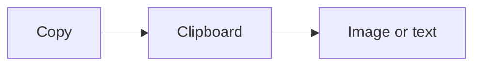

# Chat Markdown / Copy 検証

このファイルで次を確認します。

1. 右下チャットとインラインコメントに `**太字**` と改行（実際の改行、および `\n` 文字列）が描画される
2. 画像・Mermaid・コードの右上コピーボタン（鉛筆の左）が動く
3. Request Changes の `human:` 通知でも、リテラル `\n` が実改行になる（ペイン上で二行に分かれる）

## 段落

最初のレビュー対象です。ここをクリックしてインラインコメントを開き、次を投稿してください。

```
**太字** と `code` と改行
二行目
```

## 画像


## コード

```javascript
function greet(name) {
  return `hello ${name}`;
}
```

## Mermaid


