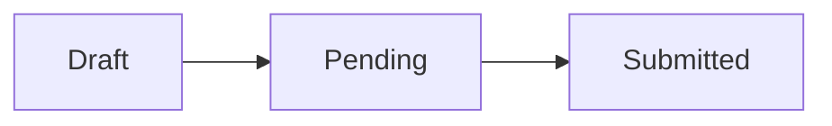
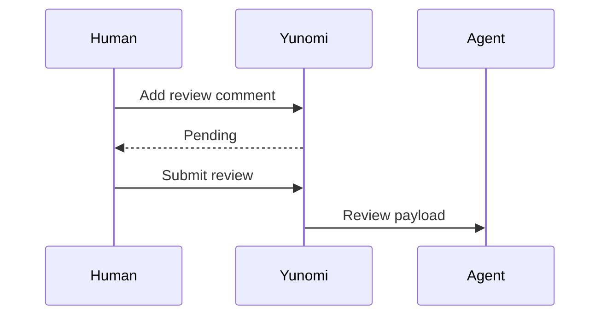

# 複雑Markdownショーケース 🍵

このページは、長い日本語、絵文字 🐈☕、深い入れ子、複数の図表を同時に表示しながら、各ブロックへインラインコメントできることを確認するための実例です。

## 深いネストリスト

- 第一階層: レビューの入口
  - 第二階層: 行アンカーを確認
    - 第三階層: コメントを追加
      - 第四階層: リロード後も復元
- 同じリスト内のコード:

  ```ts
  const review = {
    state: "pending",
    message: "日本語と emoji 🐾",
  };
  ```

1. 設計を読む
2. コメントを書く
   1. 単発なら `Add single comment`
   2. まとめるなら **Start a review**
3. `Submit review` で確定する

## 引用とネストblockquote

> レビュー対象の背景です。
>
> - 引用内の箇条書き
> - **強調**、`inline code`、[参照リンク][yunomi]
>
> > 二段目の引用では、日本語の長文が折り返しても隣の要素やコメントeditorへ重ならないことを確認します。設計判断の理由と利用者への影響を同じ場所で読み比べられます。

## 複数Mermaid





## インライン記法を混ぜたテーブル

| 対象 | 状態 | 説明 |
|---|---|---|
| **見出し** | `ready` | [仕様][spec]と絵文字 ✅ |
| 動画 | *verified* | 長文でもセル幅を押し広げず、コメントは行直下へ表示される |
| Mermaid | `pending` | source / previewの両面で同じアンカーを使う |

## 多段details

<details open>
<summary><strong>Latest: 表示中の詳細</strong> ✨</summary>

open属性を持つdetailsは最初から展開され、summaryのstrongと絵文字を保持します。

<details open>
<summary><strong>Nested: 二段目</strong></summary>

- ネスト内リスト
- ネスト内の日本語本文

</details>

</details>

<details>
<summary><strong>Closed: 任意で開く詳細</strong></summary>

閉じたdetailsもsummaryを失わず、開いた後は内部ブロックへコメントできます。

</details>

## 生HTMLとメディア

<section class="showcase-note">
  <p><strong>Raw HTML:</strong> sanitizerを通しつつ構造を保ちます。</p>
  <p>二つ目の段落には <mark>highlight</mark> と日本語テキストがあります。</p>
</section>


## 動画とタイムライン

動画は独立した行に表示され、再生位置のタイムラインサムネから該当場面を確認できます。動画本体と各サムネにはインラインコメントを追加できます。


---

## 脚注と参照リンク

参照リンクは本文を読みやすく保ちます。[Yunomi][yunomi]の設計資料[^design]と、インラインコメント仕様[^comment]を確認してください。

[^design]: 行番号はMarkdown生成時に`data-source-line`へ固定します。
[^comment]: review commentはSubmitまでlocalStorageのPendingとして保持します。

[yunomi]: https://github.com/kazuph/yunomi
[spec]: https://github.com/kazuph/yunomi#readme
