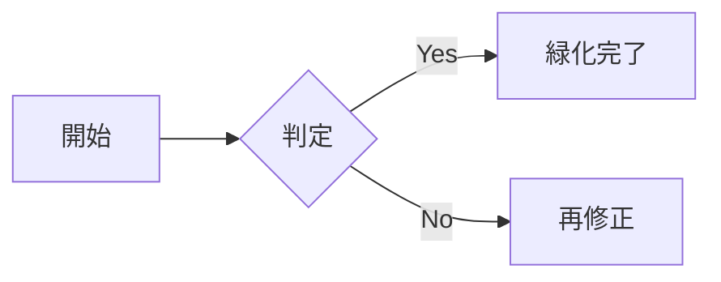

# 湯呑みグリーン化チェック

このファイルは Phase1（緑リブランド）の目視確認用サンプルです。

## 見出しと本文

段落テキストのリンクは [こちら](https://example.com) のようにアクセントカラーで表示されます。

## テーブル（狭い列を含む）

| 名前 | ステータス | 詳細 |
|------|:----------:|------|
| Alice | ✅ OK | 長めの説明文を入れて折返しの見た目を確認する |
| Bob | ⚠️ Warn | もう一つの説明文 |
| Carol | ❌ NG | さらに説明文 |

## Mermaid 図

## 質問プレビュー

  

    
<strong>Q1</strong>

    
この配色でOKですか？

    
はい、OKです

  

