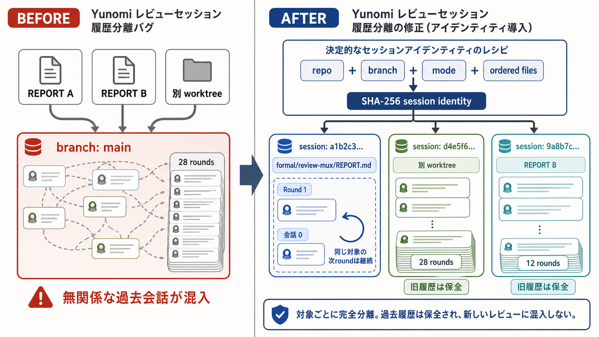
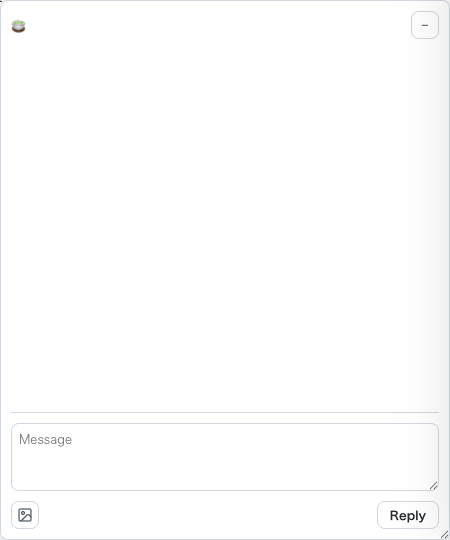
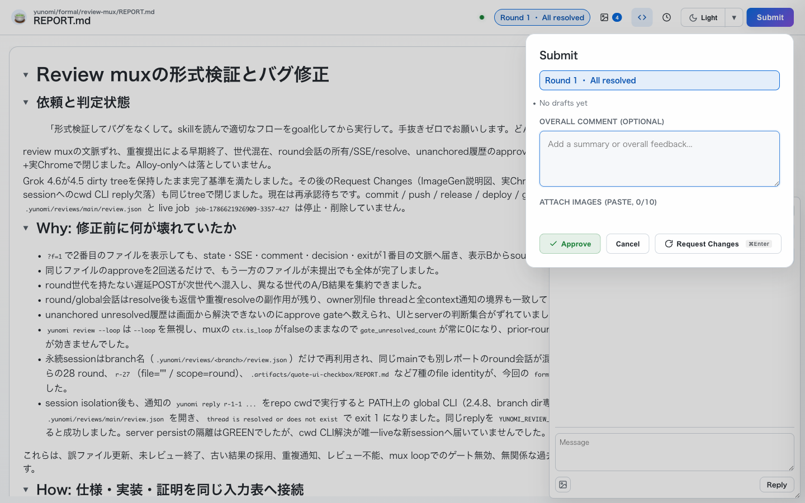
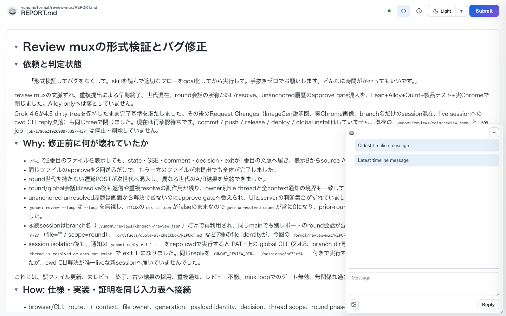
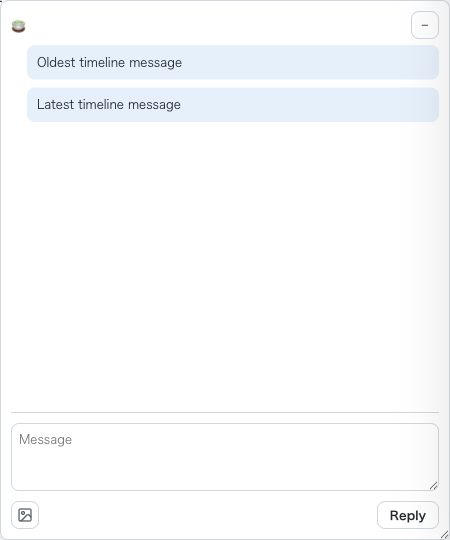
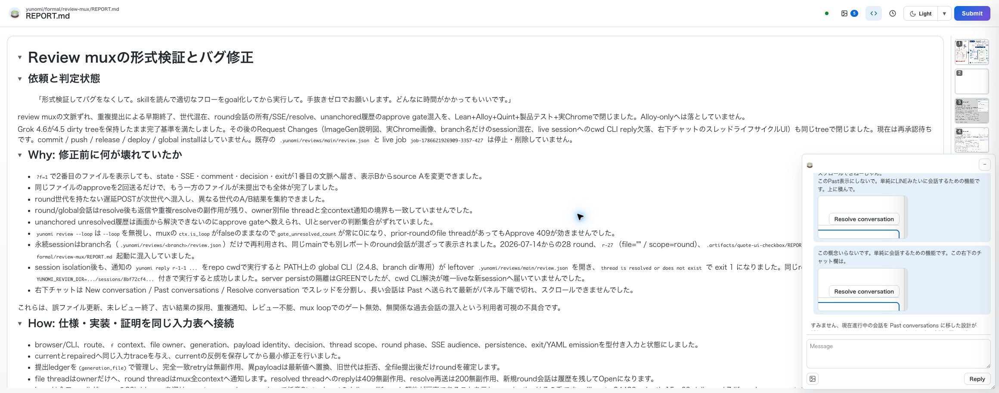

# Review muxの形式検証とバグ修正

## 依頼と判定状態

> 「形式検証してバグをなくして。skillを読んで適切なフローをgoal化してから実行して。手抜きゼロでお願いします。どんなに時間がかかってもいいです。」

review muxの文脈ずれ、重複提出による早期終了、世代混在、round会話の所有/SSE/resolve、unanchored履歴のapprove gate混入を、Lean+Alloy+Quint+製品テスト+実Chromeで閉じました。Alloy-onlyへは落としていません。

Grok 4.6が4.5 dirty treeを保持したまま完了基準を満たしました。その後のRequest Changes（ImageGen説明図、実Chrome画像、branch名だけのsession混在、live sessionへのcwd CLI reply欠落、右下チャットのスレッドライフサイクルUI）も同じtreeで閉じました。現在は再承認待ちです。commit / push / release / deploy / global installはしていません。legacy `.yunomi/reviews/main/review.json` と session `sessions/8bf72cf4a27da2d6afe3304eeb6b8300ec894892d18e449bf1bdff2ba5bd680e/` は削除していません。managerが旧 live `job-1786621926909-3357-427` を履歴削除なしで停止し、prepack dist `c103ad64f856443b5fa19426cc1044db152437f3ca99365657768a718840b2a3` をPATH固定して同じsession identity・port 4990・`--notify-pane p499` で `job-1786632477101-3357-470` を起動しました。現行受入serverは470です。

## Why: 修正前に何が壊れていたか

- `?f=1`で2番目のファイルを表示しても、state・SSE・comment・decision・exitが1番目の文脈へ届き、表示Bからsource Aを変更できました。
- 同じファイルのapproveを2回送るだけで、もう一方のファイルが未提出でも全体が完了しました。
- round世代を持たない遅延POSTが次世代へ混入し、異なる世代のA/B結果を集約できました。
- round/global会話はresolve後も返信や重複resolveの副作用が残り、owner別file threadと全context通知の境界も一致していませんでした。
- unanchored unresolved履歴は画面から解決できないのにapprove gateへ数えられ、UIとserverの判断集合がずれていました。
- `yunomi review --loop`は`--loop`を無視し、muxの`ctx.is_loop`がfalseのままなので`gate_unresolved_count`が常に0になり、prior-roundのfile threadがあってもApprove 409が効きませんでした。
- 永続sessionはbranch名（`.yunomi/reviews/<branch>/review.json`）だけで再利用され、同じmainでも別レポートのround会話が混ざって表示されました。2026-07-14からの28 round、`r-27`（file="" / scope=round）、`.artifacts/quote-ui-checkbox/REPORT.md` など7種のfile identityが、今回の `formal/review-mux/REPORT.md` 起動に混入していました。
- session isolation後も、通知の `yunomi reply r-1-1 ...` をrepo cwdで実行すると PATH上の global CLI（2.4.8、branch dir専用）が leftover `.yunomi/reviews/main/review.json` を開き、`thread is resolved or does not exist` で exit 1 になりました。同じreplyを `YUNOMI_REVIEW_DIR=.../sessions/8bf72cf4...` 付きで実行すると成功しました。server persistの隔離はGREENでしたが、cwd CLI解決が唯一liveな新sessionへ届いていませんでした。
- 右下チャットは New conversation / Past conversations / Resolve conversation でスレッドを分割し、長い会話は Past へ送られて最新がパネル下端で切れ、スクロールできませんでした。

これらは、誤ファイル更新、未レビュー終了、古い結果の採用、重複通知、レビュー不能、mux loopでのゲート無効、無関係な過去会話の混入という利用者可視の不具合です。

## How: 仕様・実装・証明を同じ入力表へ接続

- browser/CLI、route、`f` context、file owner、generation、payload identity、decision、thread scope、round phase、SSE audience、persistence、exit/YAML emissionを型付き入力と状態にしました。
- currentとrepairedへ同じ入力traceを与え、currentの反例を保存してから最小修正を行いました。
- 提出ledgerを`(generation,file)`で管理し、完全一致retryは無副作用、異payloadは最新値へ置換、旧世代は拒否、全file提出後だけroundを確定します。
- file threadはownerだけへ、round threadはmux全contextへ通知します。resolved threadへのreplyは409無副作用、resolve再送は200無副作用、新規round会話は履歴を残してOpenになります。
- Leanは全フィールドcasesの20k blowupを避け、route-scoped cases+simpで任意State×Inputのdelivery/lifecycle契約が恒真であることを示し、projectionはその系です。allInputs 84480、depth 15、60 delivery / 7 lifecycle representatives、公開theorem 7本、HashSet/List同値は維持しています。sorry/admit/axiom/unsafe/partial defはありません。
- `handle_review_command`が`--loop`を見て`loop_mode`を立てるようにし、muxのapprove gateをfile `--loop`と同じ契約に揃えました。
- review session identityはrepo realpath、raw branch、mode（single/mux）、順序付きcanonical display file setのSHA-256です。一致するlegacy `.yunomi/reviews/<branch>/` はそのまま継続し、不一致なら `sessions/<id>/` に新規隔離します。履歴の物理削除はありません。
- cwd CLI（reply/comment/go/status/pr-sync/MCP）は `YUNOMI_REVIEW_DIR` overrideを最優先し、次に唯一liveなsession、複数liveなら推測せずfail-closed、liveなしでcomment idがstored sessionに一意ならそのdir、同一idの衝突はfail-closed、resolved/missingは既存エラーです。
- 右下グローバルチャットは New / Past / Resolve conversation を出さず、round/global メッセージを古い順の1本のタイムラインにし、最下部の返信欄だけを残します。ファイル横の inline Resolve は Approve gate 用に残します。

正典から製品テスト・Lean・Alloy・Quintへの対応表は [README.md](README.md)、機械可読証跡は [evidence-manifest.json](evidence-manifest.json) にあります。

## What: 現在成立する製品契約

- muxの全context-bound操作は厳密な単一`f`を必要とし、欠落・重複・非整数・負数・範囲外を400にします。`/ui.js`と`/healthz`はprocess-globalで`f`を拒否します。
- staticはGET・HEAD・Range・nested CSS・traversal拒否・single-file互換を個別に扱います。
- exact retryは集計・保存・通知を増やさず、異payload再提出は同一file/世代の最新値だけを置換します。
- `request_changes`は`approve`より優先し、全file提出後にだけwaiting-goへ入り、goは世代を1回進めます。全approve完了時だけexitし、YAMLは各round・fileを1回ずつ出します。
- round/global会話はcreate → reply → resolve → resolved reply拒否 → resolve再送no-op → new createを満たし、resolved履歴を保持します。
- unanchored unresolved履歴は保持しますが、現在画面で解決不能なためapprove gateには数えません。prior-roundのanchored file threadはgateに入り、round open threadは入りません。
- `yunomi review --loop`はwritable muxのapprove gateを有効にします。
- 同じapproval loop（同一identity）のRequest Changes → `yunomi go` はround履歴・comments・attachmentsを保持します。異なる対象の起動は新しいsessionとしてAPI/UIに過去会話を出しません。
- 右下チャットは1本のタイムラインです。New / Past / Resolve conversation は出しません。ファイル横の inline Resolve は残します。

## Request Changes: session isolation

### 仕組みの説明図

修正前はbranch `main`だけを保存先にしていたため、異なる対象の会話が1つの履歴へ混ざりました。修正後はrepo・branch・mode・順序付きfilesから決定的なsession identityを作り、同じ対象の次roundだけを継続します。旧履歴は削除せず、別sessionとして保全します。

### 実Chrome（今回対象だけ、過去会話0）

修正後の新sessionをheaded Chromeで起動しました。対象は `formal/review-mux/REPORT.md` のみ。comments 0、foreign markerなし、Approve enabled、`Round 1 · All resolved`。legacy `.yunomi/reviews/main/review.json`（28 rounds / 26 comments / 混在files）は残したままです。新identityは `sessions/8bf72cf4a27da2d6afe3304eeb6b8300ec894892d18e449bf1bdff2ba5bd680e/`。

macOS Previewで上記PNGを開いて目視確認済みです。画像生成ではなく実UI screenshotです。

### Request Changes後の受入session

旧job `job-1786617255872-3357-366` のRequest Changesと会話は `.yunomi/reviews/main/review.json` に保全しています。修正前binaryのserverは停止し、再承認はidentity修正後のserverが作る今回対象だけの新sessionで行います。旧 `review.json` の物理削除や書換えでGREENにしていません。

## Request Changes: cwd CLI session解決

通知 `global comment id=r-1-1` に対し、repo cwdの `yunomi reply r-1-1 ...` が leftover branch dir を開き失敗しました。原因は PATH の global yunomi 2.4.8（`bb301af40d0e7ddcda56e8bdd8a040f7a72545ad7c74ce2ef66261983b3ec3d3`）が `.yunomi/reviews/<branch>/` だけを見ることです。当時の live server（job `job-1786621926909-3357-427`、pid 78837、port 4990）と履歴 `sessions/8bf72cf4a27da2d6afe3304eeb6b8300ec894892d18e449bf1bdff2ba5bd680e/` は破壊せず、ユーザーの r-1-1 返信は override で既に成功済みです。その後 manager が 427 を履歴削除なしで停止し、同じsession identityで 470 を port 4990 に載せています。

解決規則（`resolve_cwd_review_dir` / MCP `reviewDir`）:

1. `YUNOMI_REVIEW_DIR` があればそれを使う。
2. 唯一live（`kill -0` 可能な server.json pid）ならそのsession。leftoverは無視する。
3. 複数liveなら推測せず fail-closed（thread idが一意でも選ばない）。
4. liveなしで comment id が stored `review.json` にちょうど1つならそのsession（reply/comment）。
5. 同じ id が複数storedなら collision で fail-closed。
6. liveなし・idなし（go等）で stored が複数なら fail-closed。1つならそれ、0なら branch dir。
7. resolved / missing は既存の `thread is resolved or does not exist`。

callers: `handle_reply_command`、`reply_review_comment_cwd`、`handle_go_command`、`write_review_comment` / `review_file_path`、`post_comment_to_running_servers` の mux index、`persist_external_review`、`handle_pr_sync_command` の default path、MCP `reviewDir`。replyだけを局所修正していません。

### 現行live（470）で承認loopを続ける方法

managerが旧 427 を履歴削除なしで停止し、prepack済み dist `c103ad64...` をPATH固定して `job-1786632477101-3357-470` を同じsession identity・port 4990・`--notify-pane p499` で起動しました。Grokは 470 を停止しません。cwdからのCLI返信は PATH の `yunomi`（global 2.4.8）ではなく、このrepoの `npx yunomi reply <id> '<text>'` を使ってください。履歴削除は不要です。

### CLI resolutionのRED/GREEN

- RED+GREEN（global 2.4.8 が leftover を誤参照し、修正binaryが唯一liveへ保存・通知）: `job-1786628418380-3357-436` exit 0。
- CLI時点のルート `npm test` / prepack: `job-1786628515446-3357-437` / `job-1786629226496-3357-442`。dist body はその後のタイムラインUIで無効。現行は 469。

ImageGen図 `review-session-isolation-explainer.png` は保持しています。隔離profileの実Chrome PNG（465）も保持しています。現行live 470 の実Chrome画像は `live-session-timeline-4990.png` です。

## Request Changes: 右下チャットを1本のタイムラインにする

ユーザーは Resolve ボタンだけでなく、New conversation / Past conversations / スレッド分割そのものを拒否しました。会話が Past に送られ、最新がパネル下端で切れ、スクロール不能でした。

製品契約:

- 右下チャットから New conversation / Past conversations / Resolve conversation を除去する。
- round/global を古い→新しい1本の stream にし、返信欄は最下部だけ。
- 高さは `min(60vh, viewport - offset)`。stream が縦スクロールを持ち、最新は `scrollTop` で到達する。SSE中は下端フォロー、履歴を読んでいるときはジャンプしない（2px slack）。
- 下書きキーは `global-timeline` で create↔reply を跨いで保持する。
- バックエンドの round thread / resolve API は残す。ユーザー向けライフサイクルUIは出さない。追加マイグレーション分岐は作らない。
- ファイル横の inline `Resolve conversation` と Vim `r`（`.review-loop-inline .review-loop-resolve` のみ）は残す。
- 空の stream はドキュメント上のクリックを奪わない。メッセージがあるときだけ stream がヒット対象になり、スクロールできる。

### タイムラインのRED/GREEN

- review_loop GREEN: `job-1786631495988-3357-468` exit 0（pointer-events修正後。直前の 456/457 は stream padding で latest 到達と inline click-through が落ちた RED）。
- isolation e2e GREEN: `job-1786630842434-3357-459` exit 0。
- CLI resolution e2e GREEN: `job-1786630843651-3357-460` exit 0。
- vim keys GREEN: `job-1786630844686-3357-461` exit 0（`r` は inline Resolve）。
- headed Chrome dogfood GREEN: `job-1786631130172-3357-465` exit 0。temp `YUNOMI_REVIEW_DIR`。comments 0、New/Past/Resolve conversation なし、timeline 2 messages、Approve enabled。port 4991。当時の 427 は未使用。
- ルート `npm test` + prepack GREEN: `job-1786631600244-3357-469` exit 0。MoonBit 190/190。`dist/server/server.js` shebang込み `c103ad64f856443b5fa19426cc1044db152437f3ca99365657768a718840b2a3`、body と `v2/_build/js/release/build/server/server.js` はともに `d438b4d3984059e216c735f4f4379e9b46dbc507841eb656e9f671dab2ba2d3b`。

### 現行live 470の実Chrome受入

managerが旧 427 を履歴削除なしで停止し、prepack dist `c103ad64f856443b5fa19426cc1044db152437f3ca99365657768a718840b2a3` をPATH固定して `job-1786632477101-3357-470` を同じ session identity `sessions/8bf72cf4a27da2d6afe3304eeb6b8300ec894892d18e449bf1bdff2ba5bd680e/`・port 4990・`--notify-pane p499` で起動しました。Grokは 470 を停止していません。

同じ履歴を実Chromeで確認済みです。Approveは押さず Cancel です。

- messageCount=8、古い→新しい
- scrollHeight=917 / clientHeight=366 / overflowY=auto
- 実wheel: scrollTop 0→550（max 551）
- チャット内 New/Past/Resolve conversation=0、reply form=1
- Submit: Round 1 · All resolved、Approve enabled

## 分離した検証証拠

現行hashだけをPASSに使っています。4.5記録のLean SHA `7519ba57...`、Lean job 245/306（PROCESS_GONE_NO_EXIT）、旧Chrome port 5168、旧drift GREEN 247はPASSではありません。

### 製品

- mux context contract GREEN: `job-1786616398247-3357-363` inner EXIT 0（`--loop` parse後）。
- unanchored GREEN: `job-1786607725262-3357-252` inner EXIT 0。
- review_loop GREEN: `job-1786631495988-3357-468` exit 0（タイムライン+inline click-through。旧 273 は `__name` polyfill時点）。
- v2 release build GREEN: `job-1786616161711-3357-360` inner EXIT 0。session identity後のrebuildは `job-1786618449987-3357-375` inner EXIT 0。タイムライン後の prepack は `job-1786631600244-3357-469`。
- session isolation RED: `job-1786618823995-3357-380` inner EXIT 1。旧 `dist/server/server.js` は同じbranchの別fileへ `FOREIGN-FIRST-ROUND-THREAD` をリークし、`conversation_open` で新規round会話を拒否しました。
- session isolation GREEN: `job-1786618822491-3357-379` inner EXIT 0。API/UI隔離、basename別dir、mux順序、worktree、Request Changes→go保持、複数live時のgo fail-closed、disk保全。
- ルート`npm test` GREEN: `job-1786631600244-3357-469` exit 0。MoonBit 190/190、isolation / CLI resolution / タイムライン review_loop を含む test:v2 全通。旧 437 は CLI follow-up時点。

### Quint

- typecheck GREEN: `job-1786606947443-3357-248` inner EXIT 0。
- current RED: `job-1786607725300-3357-254` inner EXIT 1。
- repaired GREEN: `job-1786607725323-3357-255` inner EXIT 0。
- broad GREEN: `job-1786609233035-3357-266` / `267` / `268` inner EXIT 0。

### Alloy

- `job-1786608070961-3357-259` inner EXIT 0、artifacts 39、`review-mux/frozen-finish-json`。

### Leanとsemantic drift

- Lean full source GREEN: `job-1786615043191-3357-342` inner EXIT 0、154.35s、SHA256 `66d0f1953e1348e144d82eef65e19c08fe3c0e5f53ab7ef166b6f271e9e64bbd`。
- drift GREEN（現行lean hash）: `job-1786619286613-3357-389` inner EXIT 0。lean `66d0f195...` 不変。CLI follow-upで server/ffi hashは更新（main `ad280f7b...`、ffi `a7c0af27...`）。session identityとcwd CLI解決は形式モデル外の製品境界で、Lean/Alloy/Quint sourceは再実行不要です。
- 意図的drift RED: `job-1786608232468-3357-260` ほか3本、checker hash不変、inner EXIT 1。

### 実Chromeドッグフード

Playwright `channel=chrome` headed、隔離profile。mux gate: job `job-1786616351939-3357-362` inner EXIT 0。session isolation: job `job-1786619251480-3357-386` inner EXIT 0。

mux gate:

- healthz 200、generation 2、mux files `first/report.md` / `second/report.md`。
- prior-round anchored file: `gate_unresolved_count=1`。
- round open thread作成後もgate=1（増えない）。
- Approveはfile+round open中disabled、`/exit` 409 `unresolved_comments`。
- file resolve後gate=0、roundはunresolvedのまま、Approve enabled、クリック200。
- page error 0。

session isolation:

- 対象files `["formal/review-mux/REPORT.md"]`、comments 0、foreign_hits []、Approve enabled。
- 証拠PNG: `session-isolation-empty-chat.png` / `session-isolation-timeline.png` / `session-isolation-approve-gate.png` / `session-isolation-full-ui.png`。
- タイムライン headed Chrome: `job-1786631130172-3357-465` exit 0。New/Past/Resolve conversation なし、timeline 2 messages。
- 現行live 470 実Chrome: port 4990、同じsession履歴、messageCount=8、実wheelで latest 到達。画像 `live-session-timeline-4990.png`。ApproveはCancel。
- 詳細は [chrome-dogfood-evidence.json](chrome-dogfood-evidence.json) と [session-isolation-chrome-evidence.json](session-isolation-chrome-evidence.json)。

## 独立最終レビュー

- `git diff --check` tracked: exit 0。Lean/dogfood/REPORTにtrailing whitespaceなし。
- P0=0、P1=0。
- projectionを恒真の系にしたことは契約の縮小ではなく強化です。
- session identityはrepo/branch/mode/順序付きfile setのSHA-256。legacy一致時は既存dirを継続し、不一致時は`sessions/<id>/`へ隔離。物理削除なし。
- cwd CLIは唯一live sessionへ届く。複数liveと同一id衝突はfail-closed。`YUNOMI_REVIEW_DIR` は維持。
- 右下チャットは1本のタイムライン。空の stream はドキュメントクリックを透過し、メッセージがあるときだけヒットする。global Resolve は出さない。inline Resolve は残す。
- 担当外のdirtyは巻き戻していません。test:v2へ isolation契約と CLI resolution契約を追加済みです。
- 旧 live `job-1786621926909-3357-427` は manager が履歴削除なしで停止しました。現行 live は `job-1786632477101-3357-470`（port 4990、dist `c103ad64...`）。Grokは 470 を停止していません。global install していません。

## 明示した限界

- 形式モデルは最小反例領域の2 fileです。generation 3/4はQuintのランダム探索では未到達です。Alloy SAT witnessと製品generation 4 E2EとLean有限閉包でカバーしています。
- filesystem書込失敗、外部notify command失敗、network reconnect時のdelivery lossは形式化していません。
- share token認可は製品E2Eで確認し、形式モデルには入れていません。
- mux HTML cacheは起動時generationを焼き込みます。起動後にreview.jsonだけを書き換えるとstale generationの409になります。通常のgo経路は`refresh_review_mux_html`します。
- 4.5のzombie Lean job 245/306はNOT PASSのまま放置しています（このタスク由来のlive processではありません）。

commit、push、PR、release、deploy、外部送信は行っていません。作業treeの既存変更は保持しています。

## 承認判断

上記の修正、形式証拠、製品回帰、実Chrome結果をもって、このreview mux修正を受け入れますか？

- [ ] 承認する（推奨：現行hashのLean EXIT 0、Alloy/Quint/drift、mux contract、実Chrome gate操作が一致しているため、このまま進める）
- [ ] 修正を求める（コメントで指摘）
